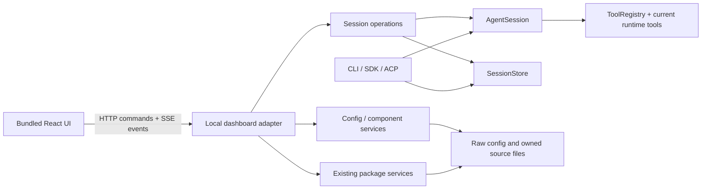

# Add a local dashboard and web chat to Raw

## Plan schema
loop-plan/v1

## Target

Run `raw dashboard` to open a local browser application for creating and continuing Raw sessions, chatting with streaming responses, and managing agents, skills, tools, vars, MCP servers and portable packages. CLI, SDK, ACP and the browser use the same agent loop, configuration contracts and persistent conversations.

The interface should feel like a focused coding assistant with useful configuration editors. It must remain easy to run, understand and customize as part of the existing Raw installation.

## Scope

Included:

- A foreground loopback server, a bundled browser application and browser launch from the CLI.
- Workspace selection, session creation/list/search/history/rename/delete, streaming chat, cancellation, manual compaction and conditional tool approval.
- Reconnecting to an active task, multiple observing tabs, durable duplicate-submit protection and CLI ↔ browser session continuity.
- An agent editor covering models, literal/file prompts, ordered tool/skill/var selection, MCP tool selection, policy and existing advanced settings.
- Local skill/tool source editing and creation/cloning, builtin/package inspection and explicit forks, configuration of vars/providers/MCP, and package import/export/update/link/fork/remove.
- Setup/repair screens when configuration is missing or invalid. Browsing and editing setup must not require model credentials.
- Current context usage and percentage, available provider usage/cache statistics, elapsed time, tool outcomes and a copyable resume command.
- English product copy and shipped instructions, documentation, browser tests and qualification of the actual installed artifact.
- Searchable, scoped Settings; browser appearance/chat preferences; command palette; persistent in-app task/approval visibility; keyboard, zoom and screen-reader behavior defined below.

Excluded from this iteration:

- A terminal TUI, desktop wrapper, hosted service, public/LAN listener, accounts, multi-user permissions or background daemon manager.
- A marketplace, automatic Git/URL package installation or a second package/config format.
- A general IDE, arbitrary filesystem explorer, embedded shell terminal, Git UI, subagent orchestration UI or autonomous scheduler.
- Browser image/file uploads into model messages. Current `UserInput` supports text and resource links; existing tools may still read files and use `view_image` with a vision model. Do not add a nonfunctional attachment button.
- Message editing/regeneration/branching, background message queues and automatic retry of interrupted operations.
- Global installation, personal config changes, publication, pushing GitHub or enabling GitHub Actions. Those remain separate requested actions.

## Invariants

1. `AgentSession` owns inference, context, tool dispatch, compaction and cancellation. The browser/server never reconstruct model context from HTML, ANSI output or displayed previews.
2. Use the existing `SessionStore`, IDs, workspace association, lease fencing, canonical model messages and visible history. No parallel web conversation database.
3. Adding this surface must not bump storage format 5 or strand readable sessions. Optional receipt tables use the existing additive table pattern. Unsupported unrelated legacy stores remain isolated by `locateSessionStore`.
4. A session has one executing writer, regardless of tabs or transports. Observing a session does not acquire a lease or refresh conversational retention.
5. Refresh, stream reconnect and duplicate HTTP delivery never initiate another model/tool execution. A crash with uncertain tool effects remains `outcome_unknown`; it is not automatically retried.
6. Every new browser turn resolves current config and selected source snapshots. Existing in-flight work retains its snapshot. Runtime changes follow existing reconciliation/cache rules; subsequent unchanged turns stabilize.
7. Skill discovery/loading remains explicit and appended at the conversation tail. Dashboard catalog browsing never injects skills, vars or UI state into model context.
8. Preserve `ToolRegistry` policy: matching `ask` rules ask, other permitted Bash calls run normally. The UI cannot turn every Bash invocation into a confirmation or silently rewrite policy after an approval.
9. Listing/editing configuration and inspecting/installing packages remain data-only. Executing a tool, reading a provider-backed var and discovering/testing MCP are separate explicit actions.
10. Configuration on disk, owned component files and per-config package locks remain authoritative. Form state, theme and navigation preferences are not another agent configuration store.
11. Managed writes validate current contracts, preserve unrelated fields/order and detect stale revisions. Browsing one invalid/unselected component does not disable all other management pages or new conversations.
12. Bind only `127.0.0.1`; authenticate browser API requests; reject foreign origins/hosts. Raw retains its invoking OS permissions; a selected workspace is a cwd, not a filesystem sandbox.
13. Build and ship static assets with Raw. Ordinary dashboard launch needs neither a source checkout, a frontend dev server, a CDN nor an extra package-manager command.

## Baseline

- Source baseline: `54878b3` on `main`, inspected 2026-09-26.
- Existing uncommitted work adds `builtin/create_package`, brings the setup kit to six skills, and updates its docs/tests/examples. Preserve it as prior completed work; do not reimplement or silently fold it into a dashboard phase commit. Record/isolate that baseline at implementation start.
- That prior work passed build, typecheck, 21 focused checks and one installed-package test. The last committed broader qualification recorded 462 passing tests and three package tests; neither result is dashboard qualification.
- CTXE readiness was `Ready`/fresh for `/Users/lploc94/projects/raw-cli`; routing record 61 and lifecycle trace record 62 located the following boundaries. Direct source reads confirmed the relevant contracts.

| Existing code | Reusable behavior and gap |
| --- | --- |
| `bin/raw.ts:run`, `src/config.ts:parseCliArgs` | Command dispatch, help, config init and session selection; no dashboard command |
| `src/cli.ts:runCli` | Provider/tools/agent assembly, conditional permission callback, session footer and shutdown; terminal I/O must stay outside shared services |
| `src/agent.ts:AgentSession`, `RunEvent` | One run at a time, streaming, durable messages, usage, compact, abort/close; persistence currently distinguishes only CLI/ACP surfaces and has no request identity |
| `src/sessions/store.ts:SessionStore` | Keyset pages, stable session IDs/cwd, 15-second leases and owner fencing, atomic message/history commits, recovery without tool replay; no durable browser operation receipt or title mutation API |
| `src/sessions/schema.ts:initializeSessionSchema` | Format 5 already adds auxiliary tables with `CREATE TABLE IF NOT EXISTS`; suitable for optional host receipt records |
| `src/sessions/api.ts`, `display.ts`, `visible.ts` | Read APIs and visible projections; SDK resume assumes CLI and saved history has both canonical and ACP envelopes |
| `src/acp/methods.ts:createAcpServer`, `transport.ts:serveAcpWebSocket` | Proven startup/cancel/cleanup and permissions; existing ACP socket rejects browser Origin and must remain a distinct transport |
| `src/config.ts:readConfigDocument`, `loadConfig`, `validateEffectiveConfigData` | Strict JSON, duplicate-key checks, current agent/package resolution; canonical-only `sessions` settings; no reusable revision-aware editor service |
| `src/tools/plugins/runtime.ts:createRuntimeTools` | Current selected plugin/skill/var/MCP assembly; this executes imports/connects MCP, so it is unsuitable for passive catalog listing |
| `src/tools/plugins/loader.ts`, `src/skills/loader.ts` | Existing roots, ownership checks and validators; tool manifest parsing needs a data-only inspection boundary |
| `src/packages/{cli,store,archive,export,resolve-agent}.ts` | Package lifecycle and bindings already work; `addPackageAgent` embeds config mutation in a CLI module |
| `src/llm/cache.ts`, `src/llm/context.ts`, `src/terminal/footer.ts` | Usage normalization, context budget and coverage-aware cache reporting; browser needs structured values, not formatted terminal strings |
| `package.json`, `tsup.config.ts`, `scripts/test*.mjs` | Node 22.13+ TypeScript/tsup package, isolated-XDG tests and installed-consumer tests; no frontend build or browser harness |

## Design and project patterns

### D1. Command and process ownership

```sh
raw dashboard
raw dashboard --port 8787
raw dashboard --port 0 --no-open
raw dashboard --config /path/to/raw.json --agent deepseek
```

- Default address: `http://127.0.0.1:8787`; default workspace: the invoking cwd. `--port 0` requests an OS-assigned port. An occupied explicit/default port produces an actionable error; do not kill another process or silently connect to it.
- `--config` selects one management authority for this server. Without it, use the canonical Raw config path. `--agent` optionally preselects an agent for new sessions; otherwise use `default_agent`.
- Open the default browser once after listening and print the authenticated launch URL. `--no-open`, SSH/noninteractive launches and failed browser opening leave a usable printed URL. Failure to open a browser does not terminate the server.
- Reserve `dashboard` as a command at the same noun-dispatch boundary as `package`. Do not add `--tui`, a redundant `web` alias or a second launcher.
- Ctrl-C/SIGTERM stops accepting new operations, aborts startup/runs/pending approvals, closes MCP and streams, releases leases and closes the store. Browser disconnection alone does not stop work. The foreground process owns its lifetime.
- Server startup and static/settings pages work without credentials. If config or the session store cannot be opened, show a scoped diagnostic/repair screen while retaining the management server; do not infer an empty config over an unreadable file.

### D2. Navigation and visual layout

Use a stable left navigation rail for **Chat · Agents · Library**, with **Settings** anchored near the bottom. The adjacent context panel changes with the section: workspace/session list in Chat, agent list in Agents, component categories in Library and setting categories in Settings. This is Raw's layout choice, not a universal requirement for chat products. Do not duplicate the same global navigation in a top menu.

Library categories: **Skills · Tools · Vars · MCP · Packages**. Providers are edited under Vars; model connections live under Settings and are selected by Agents. Use page tabs only for the opened resource's views, such as Overview/Source/Usage; do not create a third nested sidebar hierarchy.

```text
┌─────────┬─────────────────────┬───────────────────────────────────────┐
│ raw     │ Workspace ▾         │ Session title      Search ⌘K       ⓘ │
│         │ ~/project           │ Agent: raw                 Connected │
│ Chat    │ [+ New chat]        ├───────────────────────────────────────┤
│ Agents  │ Search sessions     │ User message                          │
│ Library │                     │                                       │
│         │ Today               │ ▸ Working · 2 tools · 4s              │
│         │ ● Current task      │   ▸ read_file    done                 │
│         │ ◇ Needs approval    │   ▸ bash         waiting for approval │
│         │   Earlier task      │ Assistant Markdown / highlighted code │
│         │ Previous            │                                       │
│         │   ...               │ [ Message…                   ][Send]  │
│ Settings│                     │ ~26k / 128k · 20%  Cache —  2 tools    │
└─────────┴─────────────────────┴───────────────────────────────────────┘
```

The optional inspector opens to the right of the main content and is omitted from the sketch. It shows session ID/cwd/config, current or last-run model, selected capabilities, usage and “Copy resume command”; it is secondary to reading/chatting.

#### Layout and visual tokens

- Rail: about 64–72 px with icons plus short visible labels. Context panel: 240–320 px, default 260. Inspector: 300–360 px, default 320. Allow context/inspector resizing and reset-to-default; expose keyboard-operable resize separators.
- At 1200+ px, panels may coexist if the main content remains readable. From 900–1199 px, keep the context panel and open the inspector as an overlay. Below 900 px, use drawers and one main column. At 320 CSS px/zoomed layouts, keep composer, Save, Stop and approval actions reachable. Wide code/tables scroll inside their own region.
- Center ordinary chat prose in a ~52 rem maximum content width. Management editors use available width; long paragraphs do not span an ultrawide monitor. Put workspace/agent selection in the session header, resource title/actions in management page headers, and connection/task status in consistent locations.
- Use graphite/neutral surfaces with one indigo accent; reserve green/amber/red for success, waiting and error/destructive states. Define semantic tokens for canvas, panels, borders, text, muted text, accent, focus and status. Avoid gradients/glass effects and color-only meaning.
- Spacing scale: 4/8/12/16/24/32/48 px; modest 6–8 px corners and subtle borders. UI text defaults to 14 px, chat to 16 px, code to 14 px with comfortable line height; use local system sans/monospace fonts. Typography/font-size controls must still allow zoom/reflow.
- Default theme follows the OS, with Light/Dark overrides. Comfortable/Compact density adjusts rows/spacing, not control semantics; primary controls remain about 40 px high and icon targets at least 32×32 px. Contrast is verified in both themes rather than inferred from color names.
- Catalogs use searchable rows/tables with Name, Source, Used by and Validation status, plus contextual actions. Agent details use sections; do not render every setting/component as a decorative card. Show “Not checked” or “Needs inputs” when appropriate, not a misleading healthy indicator from passive inspection.

#### Chat and navigation interactions

- Chat is the initial screen. Session filters group by workspace/time and show running/waiting/interrupted states. Search is title-based in v1; the UI does not imply full-transcript search. Resource and setting locations have stable internal URLs so refresh/back restores navigation independently of the auth fragment.
- Assistant text uses Markdown, GFM lists/tables, syntax highlighting and copy controls. Distinguish the final answer from an expandable work/progress group containing actual reasoning and tool calls. Show tool arguments, duration and exit/error status; generic tools have a JSON fallback. Label stored/truncated previews honestly instead of offering nonexistent full output.
- Show provider-supplied reasoning live in a collapsible section, with activity milestones while waiting. Never fabricate reasoning text or a completion percentage without an actual denominator.
- Composer defaults to Enter=send/Shift-Enter=newline, with a browser preference for Ctrl/Cmd-Enter sending; respect IME composition in either mode. Stop remains available during startup/run/compaction. Preserve per-session drafts during navigation and do not append them to model context before Send. No queued turns while busy.
- Keep scrolling stable during streamed updates and history pagination; follow output only when already at the bottom. Provide “Jump to latest”. Completing a task must not steal focus from another editor or move the user to another session; restore composer focus only when the user remains in that chat flow.
- Permissions appear inline with “Allow once”/“Deny”, exact tool/call arguments and the affected session. An app-wide activity indicator links to pending approvals/running tasks even while the user is editing an agent or Settings. Approval does not change rules.
- Add a command palette (Ctrl/Cmd-K) for navigation, session-title search, New chat, selecting an agent and opening relevant Settings; it performs no shell command. Ctrl/Cmd-comma opens Settings; Ctrl/Cmd-S saves the active dirty editor. Escape dismisses a palette/dialog; it does not silently cancel a running task.
- Normal controls remain visible without knowing shortcuts. Use text labels/tooltips for icon actions, keyboard focus restoration in dialogs, and in-app links to actionable errors. No OS notification permission or global keyboard registration is needed in v1.
- Use semantic browser checks and reviewed screenshots at 1440×900, 800×900 and narrow/zoomed layouts in both themes. Include long content and keyboard focus in screenshots; do not use brittle pixel equality as the only oracle.

### D3. Architecture and delivery



- New server/transport code under `src/dashboard/`; shared host operations under `src/sessions/` and `src/management/`. Reuse `createProvider`, `createRuntimeTools`, current config/package resolvers and `AgentSession`. Extract bounded common runtime assembly/cleanup from CLI where this prevents duplication; retain ACP's peer-specific tool/discovery behavior.
- Browser code under `web/`, using React + TypeScript + Vite, Radix Primitives for dialogs/menus/tabs/focus behavior, local CSS tokens, a small icon set and CodeMirror for JSON/Markdown/JavaScript editors. Pin compatible dependency versions in the existing lockfile; keep the existing supported Node engine. Use static client rendering, not an SSR framework or monorepo conversion. Accessible primitives do not replace application-level labeling, contrast and interaction tests.
- Browser Markdown uses a React-safe renderer with GFM and the existing highlighting engine where practical; raw HTML is disabled, URL protocols are checked, and untrusted content never enters `dangerouslySetInnerHTML` unsanitized.
- Ship assets in `dist/dashboard/`. Run the frontend build after tsup's clean step. Runtime locates assets through `packageRoot()` so it works from a global installation and unrelated cwd. Editors load lazily; assets require no CDN.
- Support a defined client route map with browser history/back/forward. Direct refresh of known UI routes returns the bundled entrypoint; `/api/*`, missing asset files and unknown server paths never fall through to a misleading HTML success response.
- Use typed HTTP JSON commands and a fetch-based SSE stream carrying the same authentication header. HTTP mutation responses and stream messages are separate from model events. Do not connect the browser to the existing ACP WebSocket or relax its Origin rule.
- Define a small dashboard API contract and structured errors (`code`, `message`, optional field/details) with 400/401/403/404/409/413/422/500 semantics. API contract changes do not control session/package compatibility.

### D4. Session authority and operation receipts

- Reading/listing history never instantiates `AgentSession`, connects MCP or claims a writer. Expose active ownership as “running here”/“active elsewhere” without revealing owner tokens.
- New sessions use a validated existing directory, current management config and the chosen/default agent. Creating a session has no inference/tool side effects.
- An existing session retains its saved cwd. Browser turns explicitly use the dashboard's displayed config authority and the selected agent. Initially offer the saved agent if present, otherwise require a current valid selection; show the previous config/agent when different. A successful attachment persists the explicit current selection just as CLI `--config`/`--agent` overrides do. Do not silently load another config behind the management screens.
- Acquire the existing session lease before startup. Renew it immediately while config/tools/MCP are being prepared, including startup longer than the lease duration; transfer the same fenced owner into `AgentSession` with explicit heartbeat ownership. There is one active operation per session (start/run/compact/cleanup), shared by all browser tabs. Another session can run independently. Release the lease and close runtime tools after each browser operation so an idle open page does not prevent CLI resume and the next turn sees current config.
- Add an optional `session_operations` table in the same DB, cascade-deleted with its session. Store operation ID, client request ID, kind, request hash, accepted input/selection, state, owner generation, timestamps, committed user position and terminal result/structured metrics. This is a host receipt, not a second model transcript.
- An accepted submit is durable before returning 202. `(session_id, client_request_id)` is unique. Check for an existing receipt before attempting another lease claim. A retry with the same payload returns the existing operation, including after completion/restart; the same key with different input/selection returns 409. Hash the submitted intent, not a subsequently reloaded config's contents.
- States: `accepted → starting → running|compacting → completed|max_steps|cancelled|error`; an abandoned nonterminal operation becomes `interrupted` only after its previous writer lease is demonstrably lost. Pending user input remains inspectable; there is no automatic execution on recovery.
- Integrate operation start with the agent's first user commit: mark the receipt consumed and append the user model/history record in one store transaction. Failure before that transaction leaves input pending, and failure after it cannot append it again. Optional operation metadata must not change ordinary CLI/SDK `run()` semantics.
- Record the terminal receipt before announcing terminal completion. Existing call/result recovery remains authoritative if tool effects are uncertain. Do not promise exactly-once external shell/MCP effects across a process crash.
- Read existing canonical and ACP history envelopes through a browser projection; do not rewrite historical records. Add a web persistence surface through a shared visible-record policy, avoiding scattered copies of CLI/ACP conditions.
- Rename edits only the title and never refreshes conversational retention. Delete refuses active ownership and gives an actionable busy result. “New chat” creates another session; it does not clear an existing session's model history.

### D5. Streaming, reconnect and permission ownership

- Every stream envelope includes server instance ID, session ID, operation ID where applicable, and an increasing sequence. Map core `RunEvent` into UI events; include operation state, committed-history notifications, pending permissions and structured stats.
- A subscription starts with a snapshot boundary captured with its event watermark, then replay/live events strictly after that watermark. Capture a durable history sequence with the boundary and read the history page at or below that sequence; do not interleave a later unbounded history read with earlier buffered deltas. The snapshot contains paged committed history, active operation, in-flight visible segments and pending approval. Stable segment/call IDs link live content to committed records so commit replacement cannot display the same message twice. Clients replace the matching snapshot state and deduplicate events; they never resubmit to recover a stream.
- Keep a bounded replay ring (4096 frames or 4 MiB, whichever comes first). If a cursor is unavailable or belongs to an old process, send a reset/snapshot. Large live text uses bounded-memory temporary spooling and paged segments instead of an unbounded buffer; clean it after committed history becomes authoritative or the operation is recovered.
- Slow/disconnected readers may lose their stream and resnapshot; network write errors must not throw through the agent's event callback and abort valid work. Coalesce text chunks without coalescing away tool/permission/terminal transitions.
- Closing/reloading a tab detaches only its subscription. The server continues within the existing run limits. On process restart, authenticate through the new launch link, show durable history and interrupted receipts, and let the user send a new turn explicitly.
- Sessions owned by an external CLI/ACP process are readable but not controllable by this dashboard. Refresh their committed history/status without claiming the lease; fine-grained live deltas and permission responses apply to dashboard-owned operations. A stored session becomes runnable here when its external owner releases it.
- Any authenticated tab for this local user may stop an operation or answer its pending approval. Bind an approval to operation ID, tool call ID and a random approval ID. The first answer wins; duplicates/stale answers cannot execute another tool. Use the existing abort/timeout lifecycle; no subscriber means no automatic consent.
- Stats use `AgentSession.stats()`, `estimatedContextTokens()`, `effectiveInputBudget()` and normalized cache coverage. Label estimates, context percentage, last-turn versus session totals, and missing provider measurements. Never show unavailable cache data as zero or claim a hit from a cache key alone.
- Persist a last-run stats snapshot with its measurement time. Reading an old session without such a snapshot may display unavailable data until its next run, rather than starting a runtime just to compute a dashboard number.

### D6. Local browser boundary

- Generate a random per-process access token and place it in the printed/opened URL fragment. The client moves it into tab `sessionStorage`, removes it from the address bar and uses an Authorization header for API/fetch-SSE requests. Do not put it in query strings, logs or persistent config.
- Require authentication for every data/mutation/event route. Validate the actual loopback Host and expected browser Origin; do not enable permissive CORS. API clients without an Origin still need the token. Serve no config, keys or filesystem data from static routes.
- Use a restrictive self-only content policy, no embedding, safe Markdown/link protocols and bounded request/upload sizes. Do not auto-fetch model-provided remote image URLs or execute returned HTML/scripts.
- Component file routes operate on inspected asset handles plus contained relative paths; package stores and builtins are read-only. This bounds the editor's scope without pretending to sandbox runtime tools.
- Ordinary catalog/model responses contain credential presence/references, not actual key values. Credential edits use keep/set/clear operations. A user-requested advanced raw-config editor may retrieve full text explicitly into memory; do not persist it in browser storage or silently save masked placeholders.

### D7. Agent and component management

| Screen | Concrete v1 behavior |
| --- | --- |
| Agents | List, create, duplicate, rename, delete, select default, run a new chat; edit model, prompt text/file, ordered selections, policy and advanced fields |
| Skills | Inspect builtin/local/config-adjacent/package provenance; create/clone/edit `SKILL.md` and text resources, validate frontmatter/body cap, attach/detach on agents |
| Tools | Inspect manifest/schema and owned source; create from shipped examples, clone/edit manifest/entry/helper files, static validation, select/unselect and alias on agents |
| Vars | Edit definitions, access/source/TTL and executable provider definitions; select per agent; explicit read for readable vars with freshness/error state |
| MCP | Edit stdio/HTTP definitions and package bindings; explicit discover/test; pick exact original tool names and preserve canonical rules |
| Settings | Model CRUD and capability/request fields, current config/default agent, browser preferences, applicable retention settings and advanced strict-JSON repair/editor; groups/scopes in D10 |

- Reuse the actual parsers/validators. `config.json` is strict JSON, despite use of `jsonc-parser`; do not introduce comments/trailing commas or another schema. Candidate validation keeps the real config path so canonical-only `sessions` rules stay correct.
- Introduce a shared config mutation service with expected content revision, owned writer lock, fresh read/validation and atomic 0600 replacement. Move `addPackageAgent` to that service while retaining its public SDK entry point. UI edits preserve fields absent from a form and ordered selections; no broad spread of defaults over user data.
- On stale content, return the current revision and a conflict result; keep the draft and let the user reload/reapply. Shared Raw writers honor the same lock; arbitrary external editors do not participate in that lock, so compare bytes again immediately before publication without claiming universal filesystem CAS.
- Distinguish syntactic/structural validation from runtime verification. Passive tool inspection cannot call `loadToolPlugins()` because it imports code. Extract the manifest/schema parser for inspection without import or snapshot side effects; enumerate invalid assets as per-row diagnostics.
- Each existing source-file Save is revision-checked and atomic. V1 does not offer a misleading atomic “save all” across arbitrary source files. Create/clone a new asset by validating a staged directory and publishing it under a new ID, then attach it through a separate config operation; if attachment fails, the valid asset remains unselected and the UI reports that result.
- Show usages in the current config before removal. Detach selections deliberately before deleting an asset; do not recursively rewrite unknown configs. Default-agent/model deletion requires a coherent replacement or removal of the affected current bindings. Do not delete sessions because their past agent no longer exists.
- Builtins and installed immutable artifacts use “Fork to local”/package fork for edits. Linked packages edit their authored source and take effect on the next runtime attachment. Provenance and effective selection must remain visible.
- Policy editor supports ordered allow/ask/deny rules, canonical identity, `when.any` and RE2 patterns. Test a rule against sample arguments without executing the command. Preserve argument-specific Bash approval.
- Saving config/source does not stop a running session or invalidate its history. Show “Applies to the next turn”; next attachment performs existing runtime reconciliation.

### D8. Portable packages in the UI

- Import a local `.rawpkg` upload or an explicit local source path. Stream uploads to private temporary storage within archive limits, inspect first, show exports/inputs/prerequisites, then install under an explicit alias.
- Installation does not choose an agent or alter `default_agent`. “Use agent” asks for local agent name, existing model alias and typed inputs. “Add component” edits the selected existing agent/root binding.
- Export an existing agent through `exportAgentPackage`, present recipient-input and external-file decisions using its supported SDK options, validate/pack and offer a `.rawpkg` download. Tool/skill-only source packages retain their existing format.
- Update, inspect, list, fork, link and remove delegate to current package APIs. Keep previous valid artifacts on failure, surface affected bindings/input errors and preserve sessions. No install hooks, speculative network transport or version-only resume prohibition.

### D9. API surface

Routes are under `/api`; return typed DTOs, not whole runtime objects. Management routes use the server's one displayed config authority.

| Group | Operations |
| --- | --- |
| Bootstrap | Capabilities/version, config diagnostic, default workspace/agent, safe settings metadata |
| Activity | Bounded summary of dashboard-owned active operations/recent terminal receipts and pending approvals, without transcript/tool-argument payloads |
| Workspaces | List recent stored cwd values; validate an explicitly entered existing directory |
| Sessions | Cursor list with workspace/title filter; create; detail/history; rename; delete; metrics |
| Operations | Submit turn with request ID; compact with request ID; get receipt; cancel by operation ID |
| Events | Session snapshot/replay/live SSE; scoped paged live text when needed |
| Permissions | Answer one pending approval with operation/call/approval identity |
| Config/agents/models | Read projections, validate candidate, revision-checked mutations, explicit advanced document editor |
| Components | Data-only catalogs/details, contained text-file read/save/create/clone/delete, selection edits |
| Vars/MCP | Explicit var read, MCP discovery/test with cancellation and owned cleanup |
| Packages | Inspect/import/install/export/download/update/link/fork/remove via existing lifecycle |

Publish exact request/response/error schemas in `docs/dashboard-api.md` during implementation. Define numeric bounds in the shared contract (1 MiB ordinary JSON bodies, archive-module upload/expansion bounds, existing session page limits); test them at the adapter boundary. Do not expose a generic unaudited “call any JavaScript function” or shell-exec endpoint.

### D10. Settings, scope and editing behavior

Settings is a dedicated page with a searchable category list, not a catch-all modal. Searching matches labels, descriptions and actual config keys. Results show their category and persistence scope. Deep links open the relevant category/field from validation errors; agents retain their own capability/policy controls.

| Settings group | Contents | Authority/effect |
| --- | --- | --- |
| General | Default agent, current config path, links to config repair/initialization | `default_agent` in the displayed config; server config path is read-only launch information |
| Models & connections | Provider/method/model ID, endpoint, credentials, context/output capability fields and supported request options | Current Raw config; agents reference these model aliases; an explicit “Start test chat” uses the ordinary session flow |
| Appearance | System/Light/Dark, Comfortable/Compact, chat/code text size, panel visibility/width and Reset appearance | This browser only; takes effect immediately and cannot modify an agent or model prefix |
| Chat & keyboard | Enter versus Ctrl/Cmd-Enter sending, default reasoning/tool detail disclosure, shortcut reference | This browser only; display preferences do not add/remove stored or model-facing content |
| Sessions & storage | Retention setting where editable, read-only storage statistics, navigation to session management | Retention is editable only when this server manages the canonical config; an alternate config shows where the setting belongs without writing another file |
| Diagnostics & advanced | App/connection/version/config state, component errors, allowlisted diagnostic copy, explicit raw JSON editor | Read-only server metadata or revision-checked config editing; listener/port/startup options are shown with restart instructions, not fake editable config fields |

- Clearly label **This browser**, **Raw config** and **This agent** scopes. The selected workspace supplies cwd; it does not silently create a new workspace-settings override layer or change config authority.
- Existing terminal `ui` fields remain ordinary Raw config and can be edited in the advanced document editor. Browser Appearance never rewrites those fields or pretends its own density/font/panel preferences are new config keys.
- Store only versioned browser UI preferences under a dashboard-specific local-storage key; namespace config-specific panel/navigation choices by authority. Invalid/missing preference data falls back to usable defaults. Raw config, credentials and transcripts are not stored in these preferences. Unsaved resource drafts stay in editor state and never become implicit config writes.
- Appearance/chat preferences apply immediately and have Reset controls. Agent/model/config/source changes use explicit **Save**/**Discard**, dirty indicators, field-level validation and “Applies to the next turn”. Avoid extra confirmation dialogs for ordinary Save; an optional change summary/diff helps review substantial edits.
- On navigation away from a dirty editor, preserve the draft or offer Keep editing/Discard; never silently drop it. A stale server revision keeps the draft and offers Reload/Reapply rather than overwriting external edits. Resetting one field affects only that field and retains package override replacement semantics.
- Model route creation validates the actual existing schema. Do not imply that a provider picker has discovered available models or tested credentials. “Start test chat” creates/selects a chat; inference begins only after Send.
- Diagnostic copy is built from an allowlist (versions, operation/error codes, relevant component IDs and config location), not a scrubbed dump of config/provider responses. It excludes credentials, auth tokens, conversation bodies, command arguments, dynamic var readings and arbitrary header/env values. No automatic telemetry upload.

### D11. Feedback, onboarding and accessibility

- Keep connection state independent of task state: a run may continue while the browser reconnects. Display actual milestones such as Preparing, Thinking, Running tools and Waiting for approval; use an indeterminate indicator when progress cannot be quantified.
- Keep an app-level activity button available across pages. Fetch a bounded authenticated `/api/activity` summary on entry/focus and every two seconds while the page is visible; pause polling while hidden. It lists dashboard-owned sessions needing attention and links to the exact session. Polling reads host state only and never starts a runtime or resets an approval deadline.
- Save/copy success can use a brief nonblocking status/toast. Field errors stay by the field, save conflicts stay with the dirty draft, disconnects get a persistent connection banner, and approvals remain inline plus the activity indicator until resolved/expired. Do not hide important action requests in auto-disappearing toasts or take keyboard focus every time a tool starts.
- Missing configuration offers one clear setup path: initialize the same starter agent/config used by `raw config init`, then configure a model. Existing invalid configuration opens diagnostics/raw repair without being overwritten. Extract/reuse the starter-config factory rather than creating a second browser default kit.
- Distinguish empty states: no sessions → New chat; no models → Configure model; no results → Clear filters; missing package inputs → Configure inputs; disconnected → reconnect/reopen current launch link. Provide a concrete next action without demo sessions or automatic model calls. Suggested prompts populate the draft only.
- Target WCAG 2.2 AA for the delivered interface. Verify normal text contrast >=4.5:1 and applicable non-text/large-text contrast >=3:1; visible unobscured focus; keyboard operation; semantic labels/errors; and text reflow at 320 CSS px/400% zoom. Code/tables may use their appropriate contained two-dimensional scrolling exception.
- Use at least 32×32 px actual pointer targets for icon actions (above the WCAG 24×24 minimum absent exceptions); keep primary actions larger. Dense mode must not shrink essential controls below the target contract. Honor `prefers-reduced-motion` and keep animations brief/optional.
- Announce meaningful status changes through appropriate live regions without moving focus. Do not announce every streamed token or repeat unchanged polling statuses. Dialogs/drawers/palettes must restore focus, close by Escape where appropriate and never trap users in hidden panels. Keep a skip-to-main control and accessible names for editor inputs and icon actions.
- Combine automated accessibility checks with manual keyboard, zoom and screen-reader smoke evidence. A clean automated scan alone is not a claim of full WCAG conformance. Include busy, waiting, error, empty, stale-editor and narrow layouts in verification, not only the happy-path screenshot.

### D12. UX research basis and scope decisions

Official sources reviewed on 2026-09-26 distinguish formal accessibility requirements from reusable product patterns. The visual dimensions, navigation placement and Settings groups above are Raw-specific decisions; there is no claim that one product layout is an industry standard.

| Evidence | Decision for Raw |
| --- | --- |
| [Carbon UI shell](https://carbondesignsystem.com/components/UI-shell-left-panel/usage) documents persistent navigation and avoids a third sidebar hierarchy | Stable global rail plus one contextual panel; page tabs only for resource details |
| [VS Code layout](https://code.visualstudio.com/docs/configure/custom-layout) provides primary/secondary panels and layout customization | Optional inspector, resizable/collapsible panels, remembered browser preferences |
| [VS Code Settings](https://code.visualstudio.com/docs/configure/settings) separates setting scopes and provides search plus a JSON editor | Searchable Settings with explicit authority; Raw keeps explicit Save for runtime config instead of copying automatic apply behavior |
| [Open WebUI Workspace](https://docs.openwebui.com/features/workspace/) separates reusable composition assets and contextual creation actions | Keep Agents and Library discoverable, with consistent Create/Fork/Import actions; retain Raw's distinction between model connection and agent |
| [Carbon notifications](https://carbondesignsystem.com/patterns/notification-pattern) distinguishes persistent/actionable feedback from transient toasts | Persistent approvals/conflicts/disconnection, brief success feedback and a cross-page activity indicator |
| [Radix accessibility](https://www.radix-ui.com/primitives/docs/overview/accessibility) describes keyboard/focus/ARIA behavior in primitives | Reuse accessible building blocks and test their integration rather than assuming styling alone is enough |
| [WCAG 2.2](https://www.w3.org/TR/WCAG22/), with guidance on [status messages](https://www.w3.org/WAI/WCAG22/Understanding/status-messages.html), [reflow](https://www.w3.org/WAI/WCAG22/Understanding/reflow.html) and [target sizes](https://www.w3.org/WAI/WCAG22/Understanding/target-size-minimum.html) | Define measurable keyboard/contrast/zoom/target/status gates and document manual verification limits |

This revision prioritizes navigation, Settings, editable resources and operational feedback. Analytics home pages, themes/plugins marketplaces, arbitrary CSS injection, OS notifications, accounts, branching/regeneration and a full IDE remain outside v1. Pinning/archiving/transcript export can be designed separately after ordinary session management is usable; they are not hidden dependencies for this dashboard.

### D13. Chat timeline, tool details and context controls

The chat page has three distinct read surfaces: the **conversation timeline** preserves what happened, the **work group** explains current/past activity within a turn, and the **Context inspector** describes the reduced context currently available to the model. Expanding a historical message never sends it back to the model.

#### Timeline and history

- Render user turns and assistant responses in stored sequence, with a collapsible work group between them. While running, show the active tool/approval and recent actual reasoning; after completion, collapse routine work to a summary such as “3 tools · 8s”. Keep errors/denials discoverable. Display assistant interim commentary in sequence; only label a final answer when the recorded terminal state supports it. Cancelled/error partial text is visibly incomplete.
- Group by operation/user-turn boundaries and stable tool call IDs. Current `RunEvent` has no inference-step boundary event; do not invent “Step N” from text chunks or timestamps. Old records without operation/timing metadata retain their stored ordering and omit unavailable labels.
- Load a chronological page from the latest stored records, with an explicit Load earlier action at the top; use existing 20-default/100-maximum record cursor limits. A turn or tool pair split across pages merges by IDs as earlier records arrive. Preserve the viewport anchor when prepending and stream only toward the bottom when the reader is already following the latest output.
- Session search matches titles and workspace filters only. Selecting history is data-only and works without provider credentials. Title/agent/cwd, terminal state and copyable session ID/resume command are available without opening an executing runtime. Rename and delete are separate actions; deletion is unavailable for an active writer.
- Provide message/code Copy, timestamps in details and a Jump to latest button. Do not add fake Retry/Edit/Rerun controls: regeneration, branching and replaying a historical tool remain outside this iteration. Closing a work group only changes presentation.

#### Tool cards

- A compact row shows tool name, a meaningful argument summary and an icon plus text status. Expand to **Arguments**, **Result** and available error/timing details; long JSON/code uses highlighted, scrollable content and copy controls. Expand errors and pending approvals enough to make the needed action visible.
- Derive states from actual dispatch/permission/result evidence: requested, waiting for approval, running, succeeded, failed, denied, cancelled or outcome unknown. A declared call is not evidence that execution started; a recovered uncertain call is never shown as success. If an older projection lacks the distinction, show the recorded result with unavailable metadata instead of guessing.
- Use canonical tool identity to choose specialized summaries, not a spoofable display name. Bash shows command(s), available cwd, exit status and saved stdout/stderr previews. Read shows paths/ranges; Write shows paths/mode/change counts where available. Skills show list/load identity and saved results; vars show only the data permitted by the existing access contract; MCP shows server and original tool name. User plugins always have a generic arguments/result fallback. Batch results keep each child row's independent status.
- Reuse `VisibleToolCall`/`VisibleToolResult` projections. A bounded preview is not the complete result: distinguish an abbreviated display from truncation performed by the tool. Historical full output, write contents/diffs and image bytes may be unavailable; disclose that limitation and never reconstruct a historical diff from today's files. Do not promise a live shell console: the current runtime emits tool start and final result, not stdout/stderr deltas.
- Approvals stay attached to the exact card with Allow once/Deny, and remain discoverable through the global activity indicator. Only matching `ask` rules create them. Opening arguments or changing disclosure preferences cannot execute the tool or modify policy.

#### Compaction and context

- Keep a small context meter by the composer, for example “~26k / 128k · 20%”. The denominator is the model context window; details separately show effective input budget, reserved output, configured auto-compact trigger, last measured time and unavailable values. Cache hit/miss/coverage and last-turn/session usage belong in the inspector; do not imply an estimated token count is provider-measured billing.
- Offer **Compact context** in session actions and the Context inspector. Manual compact is enabled only for an idle, runnable session; show why it is unavailable when another operation/owner is active. It uses the same receipt/idempotency/lease lifecycle as Send and keeps the session ID. It has visible Preparing/Compacting/terminal states and Stop, without inserting a fake user message.
- Auto-compaction follows the existing agent configuration and resumes the original run after a successful compaction; no extra user submit or universal UI threshold is introduced. Show the same inline compaction activity for automatic and manual attempts. A failed attempt or exceeded input budget produces the existing actionable error, not a silently restarted run.
- Persist a stable compaction-attempt ID and a typed history record: manual/automatic cause, status, retained-turn count, available before/after token estimates and serialized byte counts, and the successful summary. Commit a successful marker/summary atomically with `replaceAgentContext`; crash/reconnect cannot show a success marker without the corresponding context replacement. Other terminal outcomes are recorded without changing context. Automatic failure must also terminate its visible activity instead of leaving a spinner.
- A successful marker reads “Context compacted” with expandable summary and available before/after estimates. `noop`, `not_smaller`, `cancelled` and failure receive distinct honest messages. Byte counts from `CompactResult` are actual serialized bytes, not token counts; capture token estimates separately. Reconnect/pagination deduplicates the marker by its stable identity.
- The Context inspector shows the latest stored summary and which recent turns remain where that metadata is available, alongside an explanation that the earlier conversation remains in History but is summarized for the model. It does not claim every historical tool result is still present in active context. Show existing skill-reload notices when compaction removed loaded skill content.
- Compact preserves visible history and changes the model-facing context; it can reduce upstream prefix-cache reuse. Do not claim it rotates the session cache key, restores old context on demand or has an Undo action. Subsequent unchanged turns follow the existing stable-prefix contract. New chat, Compact context and Delete session remain separate, explicitly named operations.

Source boundaries: `src/agent.ts:RunEvent`, `compact`, `compactWork`, `execute`; `src/compact.ts:CompactResult`, `performCompaction`; `src/sessions/store.ts:replaceAgentContext`, `getSessionHistory`; `src/sessions/visible.ts:projectToolCall`, `projectToolResult`. Today automatic compaction emits start/end events, manual compaction has no shared observer, and successful replacement does not persist a general compaction history marker; Phase 1 closes those gaps through the common runtime/store boundary.

## Global Gates

- Before a phase's focused Node/browser checks, run `npm run build` from that phase's current source. Commands below must not accidentally exercise an older `dist` tree.
- `npm run check` — existing and new Node regression suites; no paid model calls or personal XDG state.
- `npm run test:web` — Playwright with a local mock provider, in-process fixture MCP/tools and isolated XDG roots. Add Chromium/Firefox/WebKit projects; initial focused runs may use Chromium, final qualification runs all three on the available host.
- Browser gates include automated accessibility scans plus recorded keyboard, zoom/reflow, reduced-motion and screen-reader smoke checks. Verify theme/preference changes leave config bytes and model request prefixes untouched.
- `npm run test:package` — existing installed tests plus a dashboard consumer outside the checkout, loading the actual packed frontend/server assets.
- `git diff --check` — pass.
- Record exact source revision/worktree manifest, packed archive hash, commands and browser versions/screenshots. Report which native platforms were tested; do not claim Linux/Windows qualification from macOS evidence.
- Keep GitHub Actions disabled. Do not publish/install globally as part of these gates.

## Plan Review

Status: **APPROVE — self-review and external `gpt-6-astra` review, 2026-09-26.** The user authorized immediate implementation after this verdict.

External review: one round, zero actionable findings, session `.codex-review/sessions/codex-plan-review-20260926-003`. The reviewer explicitly returned APPROVE in Markdown; the runner did not normalize that output format, and finalization recorded the explicit verdict. Independent source verification was limited because the reviewer could not run CTXE under its approval policy. This session verified source boundaries using CTXE and direct reads; the baseline `npm run check` passed 463 tests. No broader source-review claim is made.

Intent-fidelity review: the eight phases deliver a local chat and management application, preserve the current CLI/session/package contracts and exclude hosted services, a TUI, a general IDE and unsolicited deployment. The existing six-skill work remains prior work.

Technical self-review checked source paths, strict JSON/canonical-config behavior, passive inspection versus executable loading, durable input consumption, duplicate lookup before lease acquisition, startup heartbeat ownership, snapshot/history watermarks, approval fencing, dirty editor conflicts and the installed static/lazy asset boundary. The draft was corrected to make startup renewal, cross-process observation and snapshot deduplication explicit. Every phase has a behavioral oracle, production obligations, focused/regression commands and a cohesive commit boundary.

Material defaults selected for review: `raw dashboard`, fixed loopback address, port 8787 with explicit port-0 support, one displayed config authority per server, React/Vite client, HTTP plus fetch-SSE, per-turn runtime attachment, no model-message file uploads in v1. These are design choices, not claims of implemented behavior.

UX revision review mapped the new navigation, scoped Settings, browser preference authority, activity visibility, onboarding, source catalogs and accessibility criteria to phases 2/4/5/6/8. It checked that UI preferences cannot mutate agent config or prompts, canonical retention does not leak into an alternate config, repeated activity reads have no runtime/approval side effects, focus is not stolen by background tasks, and deep-link refresh does not mask API errors. Formal WCAG criteria are distinguished from product patterns and Raw-specific visual choices; the implementation remains an eight-phase plan.

Chat review checked model context versus visible history, existing preview limits, lack of live shell-output/inference-step events, manual/automatic compaction observer differences, atomic summary markers and failure states. D13 is covered by phases 1/4/5 without adding regeneration, transcript replay, a second transcript store or a new compatibility gate.

No production implementation starts before the requested external APPROVE. That verdict satisfies the user's explicit conditional authorization to proceed with `$loop-implement`; no additional approval prompt is needed.

## Phase 1: Add reusable session operations and browser history projections
### Goal
Provide a transport-independent session-operation boundary with durable submit identity, metrics and readable history, ready for an HTTP adapter.
### Current behavior and gap
`AgentSession` already commits user/tool state and guards one run. `SessionStore` has fenced leases, but a repeated HTTP prompt after completion would be a new run. Visible records contain CLI and ACP shapes; passive readers need a stable projection.
### Evidence
`src/agent.ts:run`, `commitMessage`, `compact`, `compactWork`, `close`; `src/compact.ts:CompactResult`; `src/sessions/store.ts:claimSession`, `appendAgentMessage`, `replaceAgentContext`, `getSessionHistory`; `src/sessions/schema.ts:initializeSessionSchema`; `src/sessions/display.ts:storedAcpUpdates`; `src/cli.ts:runCli`.
### Pattern
Extend owned store transactions and append-only visible records. Extract bounded runtime assembly from established CLI composition; keep the existing agent loop and ACP peer behavior.
### Dependencies
Preserve the prior `create_package` work. No frontend dependency.
### Files and symbols
`src/sessions/{schema,store,api,display}.ts`, new `src/sessions/{operations,view,metrics}.ts`, `src/agent.ts`, bounded shared runtime helper, `src/cli.ts`, `src/index.ts`; `tests/session-operations.test.ts`, `tests/session-view.test.ts` and existing session suites.
### Behavioral contract
Implement D4 operation states/identity and atomic consumption of accepted input, title mutation without retention renewal, read-only projections/metrics and web-visible persistence. Add D13 shared manual/automatic compaction observations and atomic successful summary/history markers while keeping preexisting history intact. Release ownership on every terminal/error/startup-cleanup path. Current runtime reconciliation remains unchanged.
### Documentation
Create `docs/sessions.md` for operation receipts, crash states and read versus attach; update the architecture contract.
### Tests first
Cover duplicate submit while starting/running/after completion, conflicting key, failure before/after initial user commit, startup longer than a lease interval, stale lease fencing, process crash after a side effect, mixed CLI/ACP history, title retention and current-config resume. Use a filesystem sentinel and provider request counter as execution oracles. Cover manual/automatic compact success, noop, not-smaller, cancellation, failure and interrupted replacement; assert preexisting visible records are unchanged, byte/token units stay distinct and success markers commit with model context.
### Anti-shortcut coverage
A retry after the first turn completed must still produce one user model message, one inference sequence and one sentinel write. A second process cannot claim a live writer; restart never executes an accepted/interrupted receipt automatically.
### Implementation obligations
Add auxiliary tables without format gating; route receipt state through store methods, not raw SQL in future HTTP handlers. Wire optional operation identity into the real user commit and terminal persistence. Explicitly hand off startup/runtime heartbeat ownership and close startup resources on cancellation. Keep the SDK's ordinary run path usable without receipts. Share compaction event/result publication across manual and automatic paths, persist successful markers in the replacement transaction and expose last summary/context metadata without reconstructing context from visible text. Preserve mixed-surface history and preview availability information.
### Acceptance criteria
- [x] AC-1.1: Repeated identical requests execute once at the submission boundary across completion/restart — proven by `session-operations` tests.
- [x] AC-1.2: Crash recovery never replays uncertain tools and input consumption is atomic — proven by process/sentinel tests.
- [x] AC-1.3: Existing format-5/CLI/ACP history is readable and unchanged resume preserves the prefix — proven by view and existing session regression tests.
- [x] AC-1.4: Manual/automatic compaction retains visible history and publishes truthful, atomic outcomes and summaries — proven by operation/view/compaction tests including rollback.
### Focused verification
`node --import tsx --test tests/session-operations.test.ts tests/session-view.test.ts`
`npm run test:phase -- sessions`
### Phase gates
`npm run check`
`git diff --check`
### Review
Implementation review is required; verdict must be APPROVE.
### Commit
`feat: add durable session operations for local web clients`

## Phase 2: Extract configuration and component management services
### Goal
Make current agent/component contracts safely editable without starting model/tool/provider/MCP execution.
### Current behavior and gap
Config validation is coupled to file loading, tool parsing to executable loading, and agent binding writes live in the package CLI. No revision-aware CRUD/catalog API exists.
### Evidence
`src/config.ts:parseConfigDocument`, `validateEffectiveConfigData`; `bin/raw.ts:run` config-init starter; `src/packages/cli.ts:addPackageAgent`; `src/packages/lock.ts:withPackageWriteLock`; `src/tools/plugins/loader.ts:manifestFrom`, `compileSchema`; `src/skills/frontmatter.ts:parseSkillMarkdown`.
### Pattern
Reuse the strict parsers, per-config owned lock and atomic staging already used by package writes. Separate inspection from execution rather than loading runtime tools for every page.
### Dependencies
Phase 1 for session metadata/metrics references; no browser UI.
### Files and symbols
New `src/management/{config,agents,models,components,files}.ts`; reusable validators extracted from `src/config.ts` and `src/tools/plugins/loader.ts`; shared starter-config factory used by `bin/raw.ts`; `src/packages/cli.ts`, `src/index.ts`; `tests/management-config.test.ts`, `tests/management-components.test.ts`.
### Behavioral contract
Implement D7 reads, revision-checked writes, candidate validation with real config location, source provenance/contained file operations and per-row errors. Bindings keep their original form and ordered lists; whole-block package overrides remain explicit.
### Documentation
Document config revision/conflict semantics, supported edit scopes, fork behavior and separate live checks in configuration/tools/skills docs.
### Tests first
Use two config writers and an external edit between read/save; canonical-only retention; unknown fields/duplicate JSON keys; fields absent from a form; selected/unselected bad tools; a plugin with an import-time sentinel; traversal/symlink paths; builtin/package read-only edits; staged clone plus failed attachment.
### Anti-shortcut coverage
Catalog/validation of a plugin whose module writes a sentinel or throws must not import it. Saving one agent must preserve another agent's literal credentials, request fields and selection order. A stale save must not replace newer bytes.
### Implementation obligations
Move agent-binding mutation onto the shared service, keep its SDK export, and ensure CLI and management writers share ownership rules. Reuse one starter-config factory for CLI init and requested browser initialization, with identical six-skill selection and no overwrite behavior. Expose diagnostics without requiring credentials or resolving dynamic variable values. No alternate config schema or implicit list merges.
### Acceptance criteria
- [x] AC-2.1: CRUD uses real validators and preserves unrelated fields/defaults/order — proven by management config tests.
- [x] AC-2.2: Passive catalogs perform no executable import/provider/MCP/model call and isolate invalid rows — proven by sentinel tests.
- [x] AC-2.3: Stale writes/escaping edits are rejected without changing files, and valid staged assets can be selected — proven by file and binding tests.
### Focused verification
`node --import tsx --test tests/management-config.test.ts tests/management-components.test.ts tests/package-cli.test.ts tests/package-config.test.ts`
### Phase gates
`npm run check`
`git diff --check`
### Review
Implementation review is required; verdict must be APPROVE.
### Commit
`refactor: expose shared config and component management services`

## Phase 3: Introduce the local dashboard server and CLI lifecycle
### Goal
Start an authenticated loopback server from the installed CLI, with deterministic port/startup/shutdown behavior.
### Current behavior and gap
Raw has stdio/ACP WebSocket transports and a noun dispatcher, but no HTTP/static browser server. The ACP transport intentionally refuses browser Origin.
### Evidence
`bin/raw.ts:run`, `src/config.ts:parseCliArgs`, `src/acp/transport.ts:serveAcpWebSocket`, `src/package-root.ts:packageRoot`, `tsup.config.ts`.
### Pattern
Keep a thin command dispatcher and owned server object with `close()`. Follow existing loopback/abort/cleanup patterns while using a separate browser transport.
### Dependencies
Phases 1–2. Static-route tests use fixture assets until the real frontend lands in Phase 5.
### Files and symbols
New `src/dashboard/{cli,server,auth,contract,errors,static}.ts`; `bin/raw.ts`, `src/index.ts`; `tests/dashboard-server.test.ts`, `tests/dashboard-cli.test.ts`.
### Behavioral contract
Implement D1/D6 startup, token lifecycle, host/origin checks, request limits, bootstrap diagnostics, static containment and graceful shutdown. Server construction accepts fixture factories for tests, never hidden production fallback providers.
### Documentation
Create `docs/dashboard.md` and `docs/dashboard-api.md`; update CLI help with the exact command/options and lifecycle.
### Tests first
Cover port 0 and occupied port, no credentials/missing/invalid config, `--no-open`, browser-open failure, correct/foreign host and Origin, missing/stale token, query-token refusal, oversized request, static traversal and SIGINT with a starting child process.
### Anti-shortcut coverage
An arbitrary webpage with a valid-looking localhost URL cannot mutate config or start a session. A port collision cannot attach to another process. Closing the server after a failed start releases every owned listener/child.
### Implementation obligations
Keep ACP validation unchanged, authenticate all data routes, print only the actual listening URL and perform browser opening without shell interpolation. Expose structured operational errors while preserving the settings repair path.
### Acceptance criteria
- [ ] AC-3.1: The CLI starts/closes a loopback server and reports its real address without a model dependency — proven by subprocess tests.
- [ ] AC-3.2: Unauthorized/cross-origin requests and escaping static paths cannot access data or mutate state — proven by HTTP boundary tests.
- [ ] AC-3.3: Shutdown and failed startup leave no owned child/listener/lease — proven by lifecycle tests.
### Focused verification
`node --import tsx --test tests/dashboard-server.test.ts tests/dashboard-cli.test.ts tests/acp-transport.test.ts`
### Phase gates
`npm run check`
`git diff --check`
### Review
Implementation review is required; verdict must be APPROVE.
### Commit
`feat: launch an authenticated local dashboard server`

## Phase 4: Add chat, history, streaming and approval APIs
### Goal
Expose reliable browser session control, read snapshots and streaming without coupling execution to a network connection.
### Current behavior and gap
Core events and durable history exist; browser cursors, fan-out, pending-approval ownership and disconnect-independent execution do not.
### Evidence
`src/agent.ts:RunEvent`, `stats`, `estimatedContextTokens`; `src/tools/registry.ts:dispatch`; `src/sessions/visible.ts`; `src/llm/cache.ts:summarizeUsage`; `src/terminal/footer.ts:formatTurnFooter`; Phase 1 operations.
### Pattern
Use core operation services and a nonthrowing observer adapter. Reuse the registry's approval callback and stable call/result linkage rather than introducing a second policy engine.
### Dependencies
Phases 1–3.
### Files and symbols
New `src/dashboard/{sessions,streams,live-output,approvals,metrics,activity}.ts`; route registration in `server.ts`; `tests/dashboard-sessions.test.ts`, `tests/dashboard-streams.test.ts`, `tests/dashboard-approval.test.ts`.
### Behavioral contract
Implement D4/D5/D9 including workspace validation, snapshots with watermarks, bounded replay/spooling, request receipts, cancel/compact, history pagination, title search and structured usage. Expose D13 typed tool/compaction details, current summary and model-context availability without executing historical content. Add the bounded data-only activity summary in D11. Read subscriptions/polling never own a runtime, reveal approval arguments through the summary or extend approval deadlines.
### Documentation
Specify route/event DTOs, cursor reset behavior, busy/conflict semantics, pending-input/crash states and permission expiry in `docs/dashboard-api.md`.
### Tests first
Mock provider streams interleaved text/reasoning/tool calls; simulate refresh, slow consumer, old cursor, two tabs, lost POST response, server death and another CLI process. Test cancel during MCP startup/provider/tool/approval/compact, stale approval and compaction rollback. Verify current prompt/helper changes then one stable unchanged turn. Test compaction progress/outcomes through manual and automatic paths, one durable marker after reconnect, history page boundaries within a turn/tool pair and legacy detail unavailability.
### Anti-shortcut coverage
Disconnect one subscriber mid-tool and reconnect: the sentinel increments once, the other subscriber keeps receiving, and the first rebuilds an identical final history. A rule matching Bash `rm` waits for approval while a safe command has no permission event.
### Implementation obligations
Do not pass a socket writer directly to `AgentSession.run`. Serialize snapshot/live publication, persist terminal receipts before announcing them, clean transient output, release idle runtime ownership and normalize historical ACP envelopes without executing them.
### Acceptance criteria
- [ ] AC-4.1: Refresh/reconnect/multiple tabs converge on one execution and complete ordered history — proven by stream tests.
- [ ] AC-4.2: Conditional approvals, denial, expiry and cancellation preserve existing policy and linkage — proven by permission tests.
- [ ] AC-4.3: CLI ↔ web resume preserves the session ID, current selection and stable unchanged cache prefix — proven by process/mock payload tests.
- [ ] AC-4.4: Usage/context values identify unavailable/estimated fields and persist without opening a runtime on reads — proven by metrics tests.
- [ ] AC-4.5: Manual/automatic compaction, historical tool states and paged turn boundaries retain correct identity/status without replay — proven by session/stream tests.
### Focused verification
`node --import tsx --test tests/dashboard-sessions.test.ts tests/dashboard-streams.test.ts tests/dashboard-approval.test.ts tests/session-cli.test.ts tests/session-acp.test.ts`
### Phase gates
`npm run check`
`git diff --check`
### Review
Implementation review is required; verdict must be APPROVE.
### Commit
`feat: stream resumable web sessions and conditional approvals`

## Phase 5: Build the browser chat experience
### Goal
Ship a usable browser workspace/session/chat surface with readable streaming and the existing runtime behavior.
### Current behavior and gap
The new server/API is available after Phase 4, but there is no browser application, frontend delivery pipeline or browser regression harness.
### Evidence
Phase 4 DTOs; existing `src/terminal/{renderer,footer}.ts` presentation concepts; `src/sessions/visible.ts`; `package.json`/`tsup.config.ts` installed build pattern; `tests/fixtures/mock-provider.ts`.
### Pattern
Create a thin typed client over server state. Keep transient UI state in React and resumable state on the server; render immutable DTOs without mutating model content.
### Dependencies
Phases 3–4. Add frontend dependencies/scripts and Playwright setup in this phase; install the test browsers with `npx playwright install chromium firefox webkit` on the qualification host.
### Files and symbols
New `web/{index.html,src/*}`, shared AppShell/CommandPalette/ActivityButton and browser preference modules; `vite.config.ts`, browser TypeScript config, `playwright.config.ts`, `tests/dashboard-ui/fixtures.ts`, `tests/dashboard-ui/{shell,chat,reconnect,approval,accessibility}.spec.ts`; `package.json`, lockfile, build/test scripts and static asset wiring.
### Behavioral contract
Implement D2/D13 chat/navigation/sessions/inspector, timeline/work groups/tool cards, token bootstrap, reconnect/reset reducer, Draft/Send/Stop and compact behavior. Include browser-only Appearance/Chat preferences from D10 and the feedback/accessibility contract in D11. Render only actual provided reasoning and tool results. New chat follows the selected workspace and agent; expose busy owners and field-specific errors.
### Documentation
Add screenshots and task-oriented chat instructions to `docs/dashboard.md`; document browser build/test commands for contributors.
### Tests first
Browser scenarios create a session, send Markdown/code, observe reasoning/tools, cancel, approve/deny, paginate old history, rename/delete idle sessions, refresh midstream and resume via CLI. Compact manually and automatically, expand the saved summary, keep older history readable, handle no-op/failure/Stop and verify no duplicate user or marker appears. Check generic/MCP/batch tool cards, denied/unknown outcomes and abbreviated-versus-truncated output; no invented full diff or live stdout. Check IME/send-mode behavior, command palette/deep links, keyboard focus, draft preservation, scroll position, activity visibility after navigation and malicious Markdown/link content. Verify theme/density/text-size changes preserve config bytes and model requests, invalid preferences fall back, and milestone announcements do not repeat per token/poll.
### Anti-shortcut coverage
Tests drive the real HTTP server and mock provider, not a hardcoded client transcript. Refresh after losing a submit response must recover the same receipt. A pending permission stays discoverable from Settings, while task completion never steals editor focus. Browser startup from built assets works without a Vite server/CDN.
### Implementation obligations
Bundle local assets, add accessible controls and error/empty/reconnect states, keep stats estimates explicit, and ensure the browser stream cannot cause duplicate user bubbles/history records. No client-only transcript authority or model API keys in request payloads to upstream services.
### Acceptance criteria
- [ ] AC-5.1: A user completes new/resumed chat with streaming, typed tool details, permissions, cancellation and compact/summary inspection while older history stays readable — proven by Playwright.
- [ ] AC-5.2: Refresh/IME/history scrolling/drafts remain correct and unsafe content does not execute — proven by behavioral browser tests.
- [ ] AC-5.3: Both themes, density modes and narrow/zoomed layouts keep controls legible, reachable and keyboard-usable — proven by screenshots, automated checks and keyboard/zoom inspection.
- [ ] AC-5.4: Appearance/chat preferences affect only the browser, navigation/command palette restore context, and task/approval attention survives page switches — proven by shell/preferences/activity tests.
### Focused verification
`npm run build`
`npm run test:web -- tests/dashboard-ui/shell.spec.ts tests/dashboard-ui/chat.spec.ts tests/dashboard-ui/reconnect.spec.ts tests/dashboard-ui/approval.spec.ts tests/dashboard-ui/accessibility.spec.ts --project=chromium`
### Phase gates
`npm run check`
`npm run test:web -- --project=chromium`
`git diff --check`
### Review
Implementation review is required; verdict must be APPROVE.
### Commit
`feat: add the browser chat workspace and session interface`

## Phase 6: Add agent, model and component editors
### Goal
Let users compose and customize agents and their capabilities through the browser using existing Raw files/contracts.
### Current behavior and gap
Phase 2 provides management services and Phase 5 supplies the app shell, but management still lacks HTTP/UI workflows, previews and actionable validation.
### Evidence
Phase 2 services; `src/config.ts:loadConfig`; `src/skills/frontmatter.ts`; `src/tools/policy.ts`; `src/vars/{config,resolver}.ts`; `src/tools/mcp-client.ts`; six shipped setup skills.
### Pattern
Pair explicit management operations with form/advanced editors, preserve disk authority and provenance, and separate static validation from explicit executable checks.
### Dependencies
Phases 2–5.
### Files and symbols
New management routes under `src/dashboard/management.ts`; `web/src/pages/{Agents,Skills,Tools,Vars,Mcp,Settings}*` and shared editors/selectors; settings categories/search/scope labels and allowlisted diagnostic-copy service; `tests/dashboard-management.test.ts`, `tests/dashboard-ui/{management,settings}.spec.ts`.
### Behavioral contract
Implement the D7 CRUD matrix and D10 Settings groups/search/scopes. Support literal/file prompt edits, ordered capability selection, canonical conditional rules, package binding overrides, source-file revisions, builtin forks, readable-var checks and owned MCP discovery/test. Implement D11 contextual empty states and shared-factory setup. Invalid config enters repair mode rather than preventing app launch; session-retention editing respects the canonical-only contract.
### Documentation
Explain provenance/forking, next-turn effects, strict JSON and verification levels. Extend `docs/dashboard-api.md` with management operations and revision errors.
### Tests first
Create an agent, select a model/skill/tool, save and run it; edit prompt/tool helper during an active run and see changes only next turn; stale editor versus CLI write; invalid JSON repair; fork a builtin; var read versus passive list; MCP discover/select/cancel; policy sample evaluation without shell execution. Cover Settings search by field/key, dirty navigation/Save/Discard, browser/config/agent scope separation, alternate-config retention visibility, CLI/browser starter equivalence and diagnostic output excluding sentinel secrets/conversation data.
### Anti-shortcut coverage
Create a tool with import-time side effects, browse/edit its files and assert the sentinel remains absent until an explicit runtime check/run. Two editors cannot silently overwrite each other. Editing a used skill must not require a new conversation ID.
### Implementation obligations
Expose all existing advanced settings through the validated editor without duplicating schemas in form-only defaults. Load CodeMirror lazily; protect dirty drafts; retain unknown-to-form supported fields. Report real prerequisites/errors instead of treating a save as a successful MCP connection.
### Acceptance criteria
- [ ] AC-6.1: Users create/edit/select each declared component type and run a composed agent — proven by API and browser tests.
- [ ] AC-6.2: Passive management has no execution side effects and stale/invalid saves preserve original data — proven by sentinels/conflict tests.
- [ ] AC-6.3: Saved changes affect the next turn and existing sessions remain usable — proven by multi-turn browser/CLI tests.
- [ ] AC-6.4: Settings search, setup/repair, dirty-draft protection and explicit persistence scopes work without hidden runtime calls or unrelated-file writes — proven by settings API/browser tests.
### Focused verification
`node --import tsx --test tests/dashboard-management.test.ts tests/management-config.test.ts tests/management-components.test.ts`
`npm run test:web -- tests/dashboard-ui/management.spec.ts tests/dashboard-ui/settings.spec.ts --project=chromium`
### Phase gates
`npm run check`
`npm run test:web -- --project=chromium`
`git diff --check`
### Review
Implementation review is required; verdict must be APPROVE.
### Commit
`feat: manage agents and local components in the dashboard`

## Phase 7: Add package sharing workflows to the dashboard
### Goal
Expose the completed portable package lifecycle through a clear inspect/install/activate and export/update workflow.
### Current behavior and gap
CLI/SDK package APIs exist, while browser users cannot yet import artifacts, bind typed inputs, export a package or manage installed aliases.
### Evidence
`src/packages/{archive,inspect,store,export,resolve-agent}.ts`; shared `addPackageAgent`; `examples/packages/{mixed-kit,tool-only,skill-only}`; `tests/package-sharing-installed.test.ts`.
### Pattern
Wrap existing data-only package services. Keep installation separate from selection and preserve immutable artifacts plus recipient-owned model/input bindings.
### Dependencies
Phases 2–6.
### Files and symbols
New `src/dashboard/packages.ts`, bounded upload/download staging, `web/src/pages/Packages*` and input forms; `tests/dashboard-packages.test.ts`, `tests/dashboard-ui/packages.spec.ts`.
### Behavioral contract
Implement D8 with local artifact/source imports, typed inputs, explicit aliases, use-agent/component actions, export/download and update/link/fork/remove. Package errors remain component-specific and never trigger session deletion or migrations.
### Documentation
Add browser sharing instructions to `docs/dashboard.md`/`docs/packages.md`; document existing SDK include-file/literal options exposed by the export UI.
### Tests first
Import mixed and standalone packages; install without model credentials; bind a model/inputs and run; export/download/reinstall outside author source; update then resume same session; failed update retains previous artifact/binding; oversize/malformed upload cleans staging; removal names current dependents.
### Anti-shortcut coverage
An installed package is not automatically selected and does not alter `default_agent`. Remove the author directory before recipient activation. A failed upload/update leaves no committed partial alias and cannot execute package code.
### Implementation obligations
Use the existing install lock/digest store rather than extracting into user tool directories. Reuse manifest input semantics, report required external executables, and keep previous archives/artifacts available for explicit rollback.
### Acceptance criteria
- [ ] AC-7.1: Browser import → inspect → install → bind → run works for complete and individual exports — proven by API/browser tests.
- [ ] AC-7.2: Exported downloads activate after source removal and changed packages resume existing sessions — proven by relocated artifact tests.
- [ ] AC-7.3: Invalid uploads/updates/removals preserve valid current state without running code — proven by failure/sentinel tests.
### Focused verification
`node --import tsx --test tests/dashboard-packages.test.ts tests/package-lifecycle.test.ts tests/package-runtime.test.ts`
`npm run test:web -- tests/dashboard-ui/packages.spec.ts --project=chromium`
### Phase gates
`npm run check`
`npm run test:web -- --project=chromium`
`git diff --check`
### Review
Implementation review is required; verdict must be APPROVE.
### Commit
`feat: share and manage portable packages through the dashboard`

## Phase 8: Document and qualify the installed dashboard
### Goal
Deliver one normal Raw installation whose browser UI, runtime and setup guidance work together outside the source checkout.
### Current behavior and gap
All features are present after Phase 7; they still need exact-artifact installed/browser qualification and complete contributor/user guidance.
### Evidence
`tests/package.test.ts`, `tests/package-sharing-installed.test.ts`, `scripts/test.mjs`, `scripts/test-phase.mjs`, `src/skills/bundled/*`, `docs/evidence/session-continuity-and-packages.md`.
### Pattern
Use the established npm-pack/temp-consumer/isolated-XDG evidence pattern with real installed binary and mock upstreams. Supplement semantic tests with reviewed screenshots.
### Dependencies
Phases 1–7 and preserved six-skill baseline.
### Files and symbols
New `tests/dashboard-installed.test.ts`, `docs/evidence/local-dashboard.md`; final `package.json` files/scripts and test selectors; `README.md`, `docs/{cli,dashboard,dashboard-api,architecture,packages,skills,skill-authoring}.md`; relevant setup-skill references and generated examples.
### Behavioral contract
The packed binary serves all assets locally, including lazy editor chunks, from unrelated cwd. CLI/SDK/ACP keep working. Guidance names the actual command and explains shared sessions, next-turn changes, conditional approval and package activation without inventing behavior.
### Documentation
Finish command/reference/user guides, update `configure_raw`, `create_agent`, `create_skill`, `create_tool`, `add_mcp` and `create_package` only where browser workflows are relevant; English bodies/descriptions remain within the existing cap.
### Tests first
Install the npm tarball in a disposable consumer, launch dashboard port 0/no-open, drive the browser through create/configure/chat/reconnect/package update, stop the server and resume the same session through the installed CLI. Verify static/lazy assets while external network is unavailable, no frontend build tool is needed at launch, and output/context prefix is stable on an unchanged follow-up.
### Anti-shortcut coverage
Tests must load the packed browser/server bytes, not repository sources or Vite. A green source-server test does not satisfy installed delivery. Browser smoke uses mock providers and executable sentinels; it does not claim model instruction-following quality or untested native platforms.
### Implementation obligations
Include docs/static assets in the npm allowlist, extend required test selectors, capture source/artifact hashes and screenshots, and leave Actions disabled. Resolve actual regressions before the final review; do not declare success from a UI screenshot alone.
### Acceptance criteria
- [ ] AC-8.1: The installed artifact runs the complete local dashboard without checkout/CDN/dev tools — proven by installed browser test.
- [ ] AC-8.2: All global gates pass and CLI/SDK/ACP/session/package behavior remains covered — proven by recorded command logs.
- [ ] AC-8.3: Documentation and six skills describe the shipped UI accurately; evidence states exact bytes and limits — proven by installed resource checks and review.
### Focused verification
`npm run build`
`node --import tsx --test tests/dashboard-installed.test.ts`
### Phase gates
`npm run check`
`npm run test:web`
`npm run test:package`
`git diff --check`
### Review
Implementation review is required; verdict must be APPROVE.
### Commit
`docs: ship dashboard guidance and installed browser qualification`

## Completion Criteria

- [ ] `raw dashboard` starts the installed local browser experience with a printed usable URL and owned shutdown.
- [ ] A user creates/selects a workspace/session, chats with visible streaming/tool/reasoning states, handles conditional permissions and resumes from either CLI or browser.
- [ ] Duplicate delivery, tab refresh, reconnect, multiple tabs and process interruption do not replay submitted tasks or historical tool effects.
- [ ] Agent/model/skill/tool/var/provider/MCP/package workflows in scope work against ordinary Raw configuration and owned files.
- [ ] Configuration/source changes apply on the next turn, preserve existing conversation IDs and stabilize caching when unchanged.
- [ ] Context/usage/cache UI distinguishes measurements, estimates and unavailable data; history/settings/activity reads do not execute runtime code.
- [ ] Chat separates visible history from active model context; manual/automatic compact has durable honest outcomes and summaries, and tool details reflect only recorded evidence.
- [ ] Searchable Settings, browser-only appearance/chat preferences, dirty-state handling, command palette and cross-page task attention behave according to D10/D11.
- [ ] Light/dark/dense/narrow/zoomed states have recorded accessibility and visual evidence; theme/UI changes do not alter configuration or model prefixes.
- [ ] Static assets, editors, docs and six setup skills are present in the installed artifact; all global gates pass.
- [ ] Every phase has reviewed evidence and a cohesive commit; pre-existing skill work is preserved separately.
- [ ] No hosted service, unsolicited publication/global installation, new compatibility gate or enabled GitHub Actions was introduced.

## Progress Log

- 2026-09-26: Established user intent, inspected current dirty baseline, confirmed indexed workspace readiness and traced session/runtime/config/package boundaries. Drafted an eight-phase plan; no production dashboard implementation started.
- 2026-09-26: Completed intent-fidelity and technical self-review, validated all eight phase blocks and cited source boundaries, and checked whitespace. Plan approved by self-review; awaiting user approval to implement.
- 2026-09-26: Researched official navigation, Settings, composition, notification and accessibility guidance; expanded D2 and added D10–D12 with sources and concrete UX contracts. Updated phase obligations/tests/acceptance criteria and completed the revised self-review. No production code was changed for this research revision.
- 2026-09-26: Added D13 chat/history/tool/compaction contracts grounded in runtime/store projections; mapped atomic compact markers and browser behavior to phases 1/4/5. User requested external plan review with `gpt-6-astra` and authorized immediate implementation after APPROVE. External review is the next gate.
- 2026-09-26: External `gpt-6-astra` plan review returned APPROVE in one round with no actionable findings; finalized/stopped normally. Source-verification limitation is recorded above. Baseline `npm run check` passed (463/463). Preserved the completed package skill in a separate baseline commit.

| Phase | Status | Evidence / commit |
| --- | --- | --- |
| 1 | complete | `dfed949`; 12 focused, 142 session, 475 full tests; self-review APPROVE |
| 2 | complete | 20 focused tests, 484 full tests; self-review APPROVE |
| 3 | pending | Depends on 1–2 |
| 4 | pending | Depends on 1–3 |
| 5 | pending | Depends on 3–4 |
| 6 | pending | Depends on 2–5 |
| 7 | pending | Depends on 2–6 |
| 8 | pending | Depends on 1–7 |

- 2026-09-26 Phase 1: Completed docs-first implementation of durable operation acceptance/atomic user consumption, host-owned startup/runtime/cleanup leases, nonthrowing observers, stable visible segment IDs, mixed history projection and manual/automatic compaction markers. Meaningful red evidence: the focused contracts failed before the new services existed. Final build/typecheck, 12 focused tests, 142 session-suite tests, `npm run check` (475/475) and `git diff --check` passed. Implementation self-review APPROVE: checked duplicate lookup before ownership, killed-process effect recovery, rollback triggers, startup heartbeat, receipt transitions, unchanged prefix regressions, cleanup and typed preview limits. No phase scope deviation.
- 2026-09-26 Phase 2: Extracted config source validation and the shared starter factory; CLI initialization and package-agent binding now use revision-aware atomic config writers. Added agent/model CRUD, passive component catalogs/manifest-schema parsing, per-file revisions, staged creation/forks, explicit selection and deletion usage checks. A regression test exposed local/agent aliases sharing a folder; fixed physical-folder usage detection before deletion. Linked package inspection reads authored sources directly without snapshot/import side effects. Focused contracts were red before implementation; final build/typecheck, 20 focused tests, `npm run check` (484/484) and whitespace checks passed. Self-review APPROVE, including credentials/order preservation, stale/external edits, strict/canonical config validation, symlink containment, read-only artifacts and isolated invalid rows. Agent/model edit helpers share one cohesive module; no user-facing scope change.
