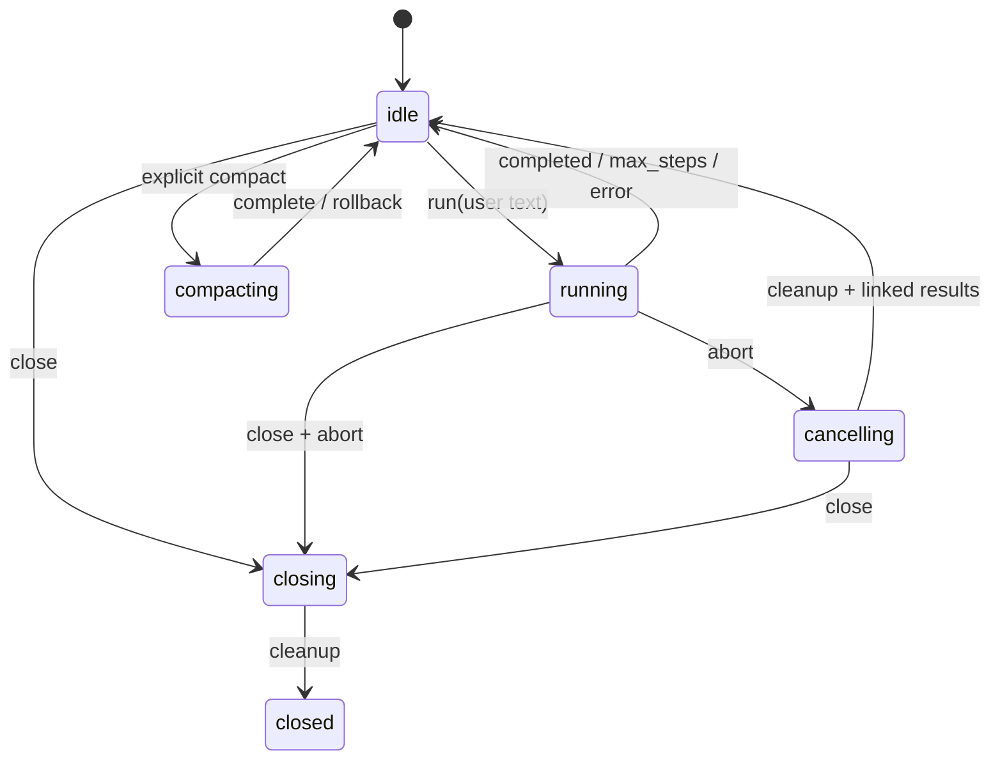

# Architecture and state ownership

`raw` keeps model-facing input small. The ordinary request contains one literal system prompt, selected tool schemas, the user's messages, and committed assistant/tool history. Configuration, provider discovery, logs, approval text, and usage statistics stay in host state. Tool schemas are measured together with the prompt, not mistaken for free context.

The configuration loader resolves one named LLM agent per session. Provider adapters stream through official SDKs into a small common event shape. The agent loop owns transcript and step count. The registry owns schema validation and exposure before execution. External MCP tools join that registry only when explicitly selected. ACP owns independent session state and protocol transport. The CLI renders events but does not reimplement the agent loop.

The global session store uses a private SQLite database in the user's state directory. It assigns stable workspace and session IDs, records ordered display history separately from model context, and exposes indexed keyset pages for session lists and the newest 20 history items. Older items remain available through an opaque cursor. A readable format-5 store stays at `raw/sessions.sqlite`. If that location holds an unsupported old format, Raw preserves it and uses `raw/stores/storage-v5/sessions.sqlite` for new sessions. Each store owns its payload files and maintenance; an old format cannot block an unrelated new conversation. There is no automatic migration of old session content. Expiry is based on the last committed conversational activity, and a read does not renew it.

Committed conversation blocks do not change between ordinary turns; new user messages and tool results append. This preserves reusable cache prefixes. A failed or cancelled tool batch must retain valid call/result linkage. At resume, recovery results for unresolved calls are committed before any skill reload notice. The session compares ordered model-facing definitions with source identities for selected plugin entries and skills. Identical generations keep the generated cache key; changed tool definitions or selected entry bytes rotate it; changed skill bytes alone keep it and add a tail notice only when prior visible skill data is stale. An explicit OpenAI cache key still wins on the wire. Manual `/compact` or agent-triggered automatic compact atomically replaces eligible older model context with a labeled summary and reminds the agent to reload any removed loaded skill text; `/clear` starts another conversation while idle. The starter agent selects three primitive tools; a vision agent may select `view_image`.

Session storage separates canonical history from the effective request view. Runtime changes update a durable generation and may mark old provider/tool messages for neutral historical replay, while retaining their original saved content. The provider request builder and token estimator use one projected view. A selected local tool runs from a content-addressed snapshot of its owned files, so an imported helper edit is detected and used on the next attachment even when the host process stays alive. Unchanged snapshots and effective settings keep the same generated key and request prefix after the change.

One ordinary inference request counts as one step. The default maximum is 25. When the last allowed request asks for a tool, the run stops before that tool executes because it cannot consume the result in another inference step. Compact requests use separate usage accounting and do not consume a tool step.

## Host operations

The shared session-operation service owns durable submit receipts, startup leases, per-turn runtime attachment and cleanup. Transports observe it without owning execution. User-input consumption commits with the first model/history write; retries return the receipt instead of running again. Successful compact summaries commit with replacement context while visible history remains available. See [Sessions](sessions.md) for identities, interrupted outcomes and read-only projections.

## Agent session loop

Each `run` appends one user message and makes at most `maxSteps` inference requests. Assistant text deltas may be shown immediately. A completed assistant response is committed only after its stream finishes. A tool request on the last permitted step ends as `max_steps` before committing declarations or executing tools. Otherwise the assistant's whole call batch is committed, then calls are dispatched in declared order. Matching results, including malformed-argument, unknown-tool, denial and cancellation errors, are appended before another inference request. One `bash` tool call can run up to 16 commands sequentially; nonzero exits remain inspectable indexed outcomes and do not stop later commands. A timeout or abort stops the active process group and skips remaining commands.

`text_delta`, `reasoning_delta`, `tool_call`, `tool_start`, `tool_result`, `usage`, `compact_start`, `compact_end`, and one `run_end` are host events. `tool_call` announces each committed declaration before validation; `tool_start` is emitted after authorization and directly before execution. Denied calls have a declaration and result, without an execution-start event. Image bytes are kept in the model transcript but removed from public `tool_result` events. Abort during inference leaves the pending user message and earlier completed history intact; partial assistant deltas are not committed. Abort during a batch retains already completed results and appends `cancelled` results for every unresolved call. A later run appends new user input to this valid transcript; it never replays side effects. A session rejects another run while busy, and closed sessions reject all new work. Separate sessions own separate cwd, transcript, controller and usage state.

Event payloads are detached snapshots. A renderer cannot mutate authorized arguments, usage or committed tool results. A renderer exception aborts the active turn, fills unresolved call results as cancelled, and returns `event_handler_error`; the agent attempts `run_end` once. An exception from the terminal event sink cannot cause a second terminal event or rewrite the completed run result.

`raw` has full permissions of its invoking OS account. Session cwd resolves relative file paths and shell working directories, without limiting access to absolute paths. Approval and whitelists decide which registered handlers raw will dispatch; they are not OS isolation mechanisms.

## Runtime variables

Variable definitions are validated config; the runtime-tools instance owns its resolver and TTL cache. CLI and ACP use the same plugin context service. Session storage owns history but never stores a separate variable cache or expanded env bindings. Definitions remain fixed within a runtime; restart/resume loads current definitions. File/env/provider values are read lazily. This adds no session schema revision.

## Portable package resolution

`raw-package.json` and `.rawpkg` archives are data contracts. Install/link/update writes a per-config atomic alias index and publishes content-addressed artifacts outside session state. `loadConfig` resolves only the selected agent and its referenced package exports into the existing runtime config. Selected tools and skills are then loaded by the ordinary registry/catalog paths; package tool helpers use immutable snapshots. Vars and MCP definitions pass through the existing validators and startup paths. The package release label and installation path are provenance, while effective prompt/schema/source bytes determine runtime transitions. Session history remains canonical and the current selection wins on resume. Package commands and agent binding avoid provider/plugin/MCP/session initialization.

## Local dashboard adapter

The loopback HTTP host authenticates commands and fetch-SSE with one process token.
`SessionOperations` owns durable request receipts and writer leases across runtime
attachment, inference/compaction and MCP cleanup. Disconnecting a browser affects
its observer only. Reconnect replays bounded events or replaces transient state
with a history-watermarked snapshot; it never submits a prompt again. Each new
operation attaches the current config and immutable selected source snapshots.

The React application renders structured history/tool/compaction views, not terminal
output. History pagination, usage estimates and the active model summary remain
separate projections. Browser appearance/navigation preferences never enter the
model request or become an additional Raw config layer. Lazy CodeMirror assets are
bundled locally, with a per-document style nonce under the host content policy.

Management routes call shared revision-aware config/component services. Static
catalogs and package operations remain passive. Explicit var/MCP checks own their
signals, deadlines and cleanup independently from chat operations. Package upload
staging validates an immutable artifact before installation; activation separately
writes recipient bindings. Dirty drafts and stale revisions are UI state, while
config files, component files and the package lock remain authoritative.

The build ships `dist/dashboard` with the CLI. Installed qualification packs Raw,
installs it into an unrelated consumer, configures it through the browser, reloads
an active real tool, updates a package, and resumes the same ID with the installed
CLI. No source-server test substitutes for that artifact path. See the
[dashboard API](dashboard-api.md). Contributors record qualification in the
repository's `docs/evidence/local-dashboard.md`.
