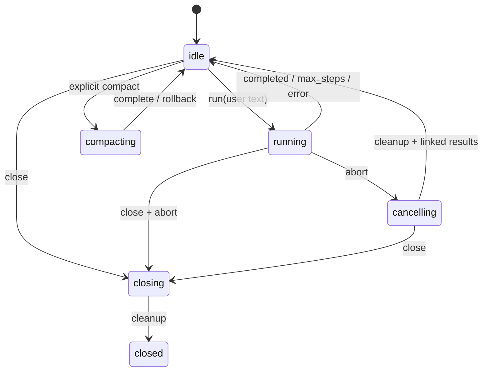

# Architecture and state ownership

`raw` keeps model-facing input small. The ordinary request contains one literal system prompt, selected tool schemas, the user's messages, and committed assistant/tool history. Configuration, provider discovery, logs, approval text, and usage statistics stay in host state. Tool schemas are measured together with the prompt, not mistaken for free context.

The configuration loader resolves one named LLM profile per session. Provider adapters stream through official SDKs into a small common event shape. The agent loop owns transcript and step count. The registry owns schema validation, exposure and authorization before execution. External MCP tools join that registry only when explicitly selected. ACP owns independent session state and protocol transport. The CLI renders events and obtains approvals but does not reimplement the agent loop.

Committed conversation blocks do not change between ordinary turns; new user messages and tool results append. This preserves reusable cache prefixes. A failed or cancelled tool batch must retain valid call/result linkage. Explicit `/compact` atomically replaces eligible older history with a labeled summary and resets the rewritten cache prefix; `/clear` discards history while idle. Both operations leave the three primitive definitions unchanged.

One inference request counts as one step. The default maximum is 25. When the last allowed request asks for a tool, the run stops before that tool executes because it cannot consume the result in another inference step. Compact is an explicit separate inference operation.

## Agent session loop

Each `run` appends one user message and makes at most `maxSteps` inference requests. Assistant text deltas may be shown immediately. A completed assistant response is committed only after its stream finishes. A tool request on the last permitted step ends as `max_steps` before committing declarations or executing tools. Otherwise the assistant's whole call batch is committed, then calls are dispatched in declared order. Matching results, including malformed-argument, unknown-tool, denial and cancellation errors, are appended before another inference request. Nonzero Bash exits remain inspectable tool results.

`text_delta`, `tool_call`, `tool_start`, `tool_result`, `usage`, and one `run_end` are host events. `tool_call` announces each committed declaration before validation; `tool_start` is emitted after authorization and directly before execution. Denied calls have a declaration and result, without an execution-start event. Abort during inference leaves the pending user message and earlier completed history intact; partial assistant deltas are not committed. Abort during a batch retains already completed results and appends `cancelled` results for every unresolved call. A later run appends new user input to this valid transcript; it never replays side effects. A session rejects another run while busy, and closed sessions reject all new work. Separate sessions own separate cwd, transcript, controller and usage state.

Event payloads are detached snapshots. A renderer cannot mutate authorized arguments, usage or committed tool results. A renderer exception aborts the active turn, fills unresolved call results as cancelled, and returns `event_handler_error`; the agent attempts `run_end` once. An exception from the terminal event sink cannot cause a second terminal event or rewrite the completed run result.

`raw` has full permissions of its invoking OS account. Session cwd resolves relative file paths and shell working directories, without limiting access to absolute paths. Approval and whitelists decide which registered handlers raw will dispatch; they are not OS isolation mechanisms.
