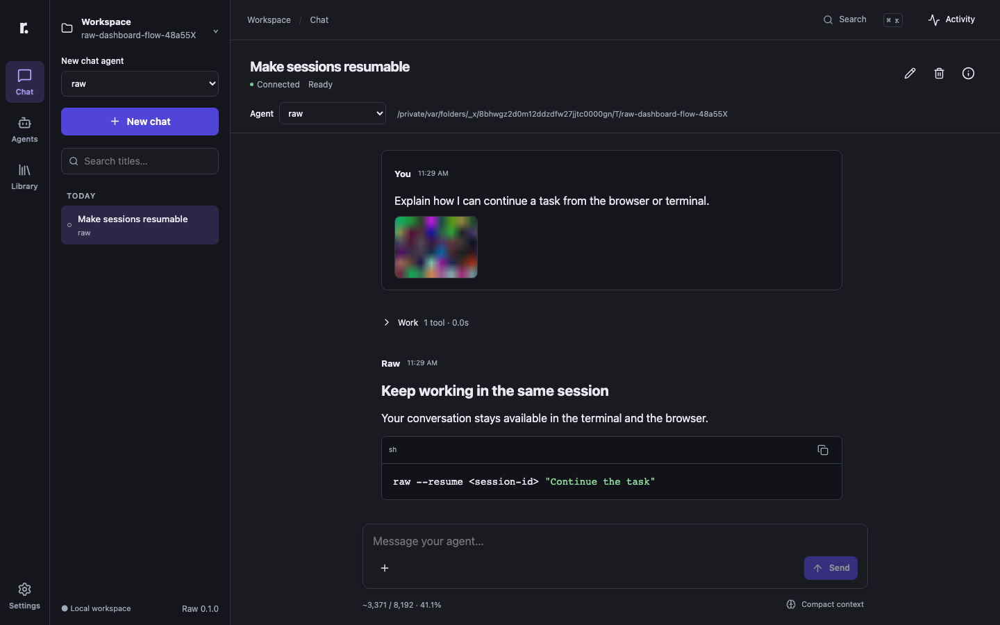
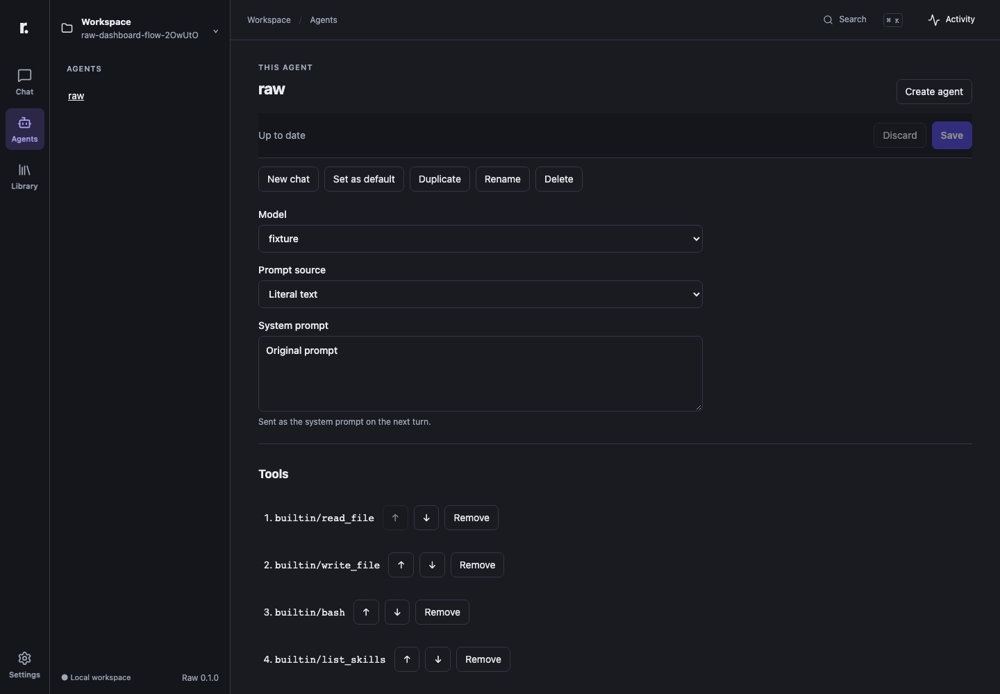
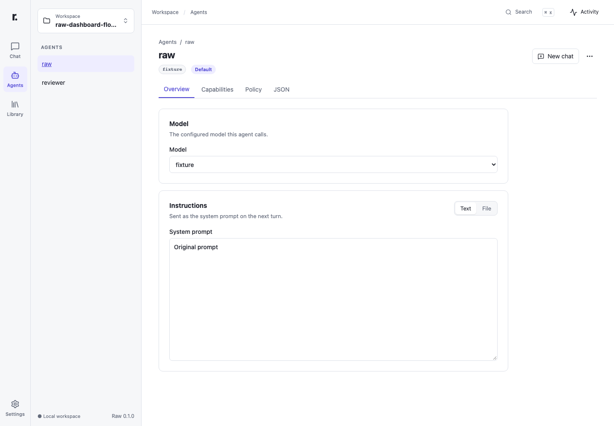
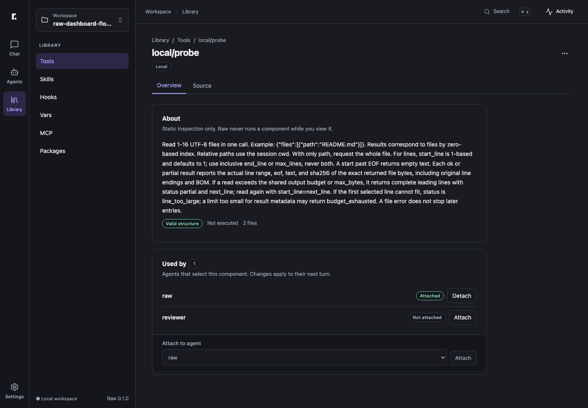
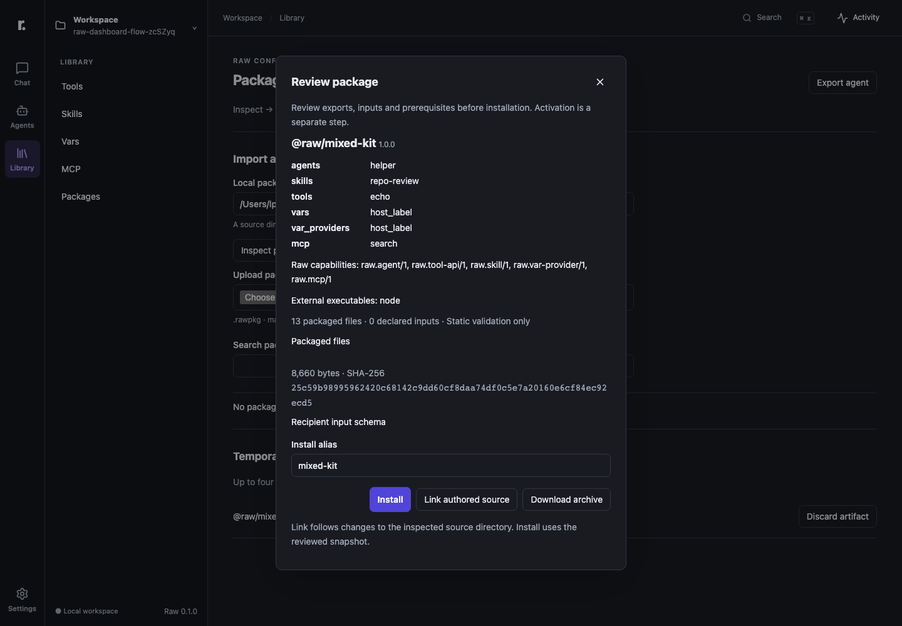

# Local dashboard

Run `raw dashboard` from the project you want to work on. Raw starts a foreground server at `http://127.0.0.1:8787` and opens your browser when launched interactively. It prints an authenticated launch link. Keep this process running while using the dashboard; Ctrl-C closes its operations, connections and session ownership.

```sh
raw dashboard
raw dashboard --port 0 --no-open
raw dashboard --config /path/to/raw.json --agent deepseek
```

`--port 0` chooses a free port. An occupied port is an error; Raw never terminates another listener or silently attaches to it. `--no-open`, SSH and noninteractive launches leave a usable printed link. Browser opening failure does not terminate a healthy server.

One dashboard manages one displayed config file. The invoking directory is its initial workspace. A workspace changes relative runtime paths, not OS filesystem permissions. Missing credentials or missing/invalid config do not prevent the setup/repair interface from loading. No model, tool or MCP connection starts just to display the application.

The launch token is in the URL fragment. The browser keeps it in tab session storage, removes the fragment from the address bar and authenticates API/stream requests through an Authorization header. A server restart creates a new token; reopen the new launch link. Do not publish a launch link to others. The server binds only IPv4 loopback and does not provide accounts, LAN sharing or a public listener.

Browser tabs observe server-owned operations. Closing or refreshing a tab does not cancel a run. Stop cancels an operation explicitly. CLI and browser use the same saved sessions; a session executing in another process remains readable, and becomes runnable in the dashboard after its writer releases it.

See [session operations](sessions.md), [management](management.md) and the [dashboard API](dashboard-api.md) for persistence, configuration authority and transport contracts.

## Chat workspace

Selected agent hooks appear in the conversation history as compact receipts showing the hook ID, event and outcome. A successful hook is visible even when its command writes no stdout. Hook messages are host status, never assistant text sent to the model. See [hooks](hooks.md) for events, filters and cancellation behavior.

Choose a workspace and agent, then create a chat. Enter sends; Shift-Enter adds a line. The Chat browser preference can require Ctrl/Cmd-Enter instead. Composition input is never sent before the IME confirms it. Drafts stay in memory when navigating between sessions. No inference starts until Send.

The message box grows with its content up to about eight lines, then scrolls. Send (or Stop while your operation runs) sits in the toolbar below it. Typing `/` at the start of the message opens a command list above the box: `↑`/`↓` move, `Enter` or `Tab` select, `Esc` closes, and focus never leaves the message box. Built-in commands: `/compact` (summarize model context; disabled with a reason while work is running), `/rename`, `/new` and `/details` (show or hide the inspector). The selected agent's skills are listed too; choosing one inserts `Use the skill "<name>" for this task. ` into the message for you to complete. While the list is open, Enter selects instead of sending; text that matches nothing, such as `/unknown`, is sent as written.

Use the `+` button for **Upload image…**, **Reference workspace file…** (inserts `@`) or **Commands** (inserts `/`). Images can also be pasted or dropped on the composer ("Drop to attach"). Each attachment appears as a chip above the message box: uploading (Send waits), ready, or an error with Retry and Remove. A chip error (unsupported type, too large, expired) affects only that chip and never blocks the text turn; failed chips are not sent. Typing `@` at the start of a word searches workspace files; choosing one adds a file chip instead of leaving text behind. An attachment-only turn sends a default line (`Please look at the attached image.`). Sent images show as thumbnails in the conversation (click to enlarge) and load again after a reload. When the selected agent cannot read images, its chips carry a warning and the note "Images in this chat are sent to this agent as text placeholders." appears; nothing is blocked.

The composer can send images and workspace file references with a turn. Images are uploaded first, staged for 30 minutes and consumed only when the turn is accepted; a rejected upload never removes other attachments or your text. Files are referenced by workspace-relative path and cannot leave the workspace. An agent whose model lacks vision still accepts image turns: it receives a text placeholder and the original image stays in the saved chat. See `dashboard-api.md` for the routes, limits and errors; `dashboard-composer-design.md` records the design.

History is chronological and Load earlier prepends older records. Jump to latest resumes following output. Work groups disclose actual reasoning, tool arguments and saved result previews; they do not replay tools. An abbreviated display and a tool-truncated result are labeled separately. Stop remains available during preparation, tool execution, approval and compaction. Inline Allow once/Deny answers only that pending call. Activity remains available from every page.

Open the Context inspector for estimated current tokens/window/percentage, last-turn and session usage, cache measurement coverage, current summary and a copyable CLI resume command. Compact context summarizes model context while preserving visible history. Empty/no-smaller/cancelled/failed attempts retain their distinct outcomes. Closing a tab keeps the operation running; reconnect replaces transient state from the server and never sends your prompt again.

Use Ctrl/Cmd-K for navigation and session-title search; Ctrl/Cmd-comma opens Settings. Appearance and Chat preferences apply only to this browser. Theme, density, font sizes, panel widths and disclosure defaults never change Raw config or model context. Preferences have a versioned, validated local-storage record; credentials and transcripts are excluded.

## Frontend development

`npm run build` builds the CLI/server and then bundles the static React application under `dist/dashboard`. The installed command needs no Vite server or external assets. `npm run test:web` runs isolated mock-provider browser scenarios; install engines once with `npx playwright install chromium firefox webkit`. Browser tests use the built application and the real authenticated HTTP API.

## Layout examples

These screenshots use a disposable workspace and a mock provider. Reproduce them after building with `node --import tsx tests/dashboard-ui/capture.ts`.



| Layout | Light | Dark |
| --- | --- | --- |
| Desktop, 1440×900 | [View](dashboard/chat-light-desktop.png) | [View](dashboard/chat-dark-desktop.png) |
| Tablet, 800×900 | [View](dashboard/chat-light-tablet.png) | [View](dashboard/chat-dark-tablet.png) |
| Narrow, 320×900 | [View](dashboard/chat-light-narrow.png) | [View](dashboard/chat-dark-narrow.png) |

[Command suggestions](dashboard/chat-dark-commands.png) show the `/` list above the composer; the desktop and narrow screenshots include an attached image in the conversation.

[Context inspector](dashboard/chat-dark-inspector.png) shows estimates, available usage, measurement coverage and the last attached capabilities. Older measurements may be unavailable or stale; viewing them does not start a model or tool.

[Native 400% zoom](dashboard/chat-native-400-percent.png) shows the complete browser
view at a 320×228 CSS-pixel viewport. Content remains reachable through vertical
scrolling without document-level horizontal overflow. On macOS, reproduce the native
zoom smoke with `node --import tsx tests/dashboard-ui/native-smoke.ts`. It opens a
disposable browser and restores the previously focused application. The optional
`--voiceover` smoke starts the system screen reader and requires the user's macOS
permission. A person listens to the Message editor and Session details button and
records the actual announcements; a successful driver exit alone is not a
screen-reader verdict. This is separate from the automated browser suite.

## Customize your agents

Agents may select ordered hooks. Use the Hooks component view to create or edit `hook.json` and scripts, then add a hook ID in the agent editor. The catalog shows event filters and validation without executing the hook. Package exports can carry selected hooks to another installation; see [hooks](hooks.md) and [packages](packages.md).

Agents selects a model, a literal or file prompt, and ordered tools, skills and
vars. JSON views expose all existing request/cache/compact/policy fields and
package overrides. Skill selections require the list/load skill tools. Policy
samples evaluate the actual ordered rules without running the sample command.

Library shows component provenance, usages and static validation. Fork a builtin
or immutable package into a local component before editing it. Each source file
has its own Save and revision. Creating/forking leaves the component unselected;
attach it to an agent explicitly. Linked package files are their authored source.
A tool's manifest name controls its model-facing name; package selections also
support the existing `{ref, as, inputs}` binding. No new alias syntax is added.

Changes apply on the next turn, including in an existing session. Saving never
cancels an active run. Unsaved editor state has Save/Discard controls and a
navigation guard; a conflict keeps the draft and offers reload or explicit
reapplication after reviewing the latest revision. Ctrl/Cmd-S saves the active
editor. Advanced config is strict JSON, with no comments or trailing commas.

Settings separates **This browser**, **Raw config** and **This agent**. Search
matches labels and actual config keys. Missing config can initialize the same
starter as `raw config init`; invalid config opens the source repair editor.
Retention belongs to the canonical config, so alternate-config dashboards show
its location without writing that other file. Diagnostics copy uses an allowlist.
Model saves perform validation only; Start test chat uses the ordinary composer.
Vars Read and MCP Discover are explicit, cancellable actions. Merely opening
Library or saving a definition does not execute a provider or connect to MCP.

Agent and source editor examples (isolated fixture data):





Reproduce these images after building with
`node --import tsx tests/dashboard-ui/capture-management.ts`.

## Share portable packages

Open **Library → Packages** to choose a `.rawpkg` file or inspect a local source
path. Review exports, recipient inputs, required Raw capabilities and external
executables before choosing an alias and Install. Inspect and install are passive;
neither selects an agent nor changes `default_agent`.

Use agent creates a local binding with your own model and typed inputs. Add
component selects a tool/skill on an existing direct agent or creates a named
vars/provider/MCP binding. Configure MCP tool selections through explicit discovery.
Package-agent overrides stay complete replacements in the Agent JSON editor.

Export agent produces a downloadable archive. By default, literal variable values
and external files become recipient decisions. The form exposes the SDK's explicit
include-literals option and a list of external files to include. Review the resulting
inputs/report before sharing. The archive works after the author's directory is
removed; recipients supply their own model connection.

Update first inspects a replacement snapshot, then applies it under an existing
alias. Failed validation keeps the current package. Resume the same session to use
the update on its next turn. Link opts into authored source changes, Fork copies
into an empty/new source directory, and Remove names any bindings that still use
the alias. Discard temporary imports/downloads when finished; stages expire after
30 minutes or when the dashboard stops.



Reproduce the package view with
`node --import tsx tests/dashboard-ui/capture-management.ts --packages-only`.
