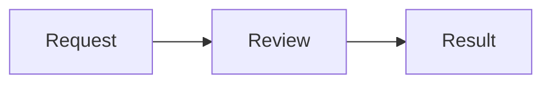

# Mermaid diagrams

Completed `mermaid` fences in assistant Markdown and `mermaid` blocks in chat or sidebar tool views share the same local renderer. No diagram service, CDN, remote fonts or images are used. An unfinished streaming fence remains readable code until its closing fence arrives.

````markdown

````

Tool document example:

```json
{"blocks":[{"id":"flow","kind":"mermaid","title":"Request flow","source":"flowchart LR\nRequest --> Review --> Result","fallback":"Request, review, then result."}]}
```

Declare the tool view with `placement: "chat"` or `placement: "sidebar"`. See the standalone [diagram example](../examples/tools/diagram/) for sidebar publishing. This is a local tool example, not a new drawing builtin. The CLI and ACP text fallback preserve the title, fallback and Mermaid source.

The diagram has source/diagram controls and a copy-source button. Narrow views scroll horizontally; diagrams use the dashboard's light/dark colors. Syntax errors, unsupported source features and render failures show source plus a short diagnostic without failing the tool or chat. Source is limited to 16 KiB of UTF-8; rendering also bounds statements, lines and edges. Large diagrams should be split into smaller ones.

## Security and supported source

Mermaid 12.0.0 and DOMPurify 3.4.16 are pinned and loaded from the bundled application only when needed. Rendering uses strict security, disabled automatic rendering and HTML labels, protected configuration, bounded text and 100 edges. This first version rejects init directives, YAML frontmatter, links/click actions, embedded HTML, URLs, images/icons, math markup and custom styling. The source filter conservatively reserves directive words such as `click`, `style` and `classDef` followed by whitespace, including in labels. Those inputs remain readable source. Ordinary flowchart and sequence syntax is supported; other Mermaid syntax may render if it passes the same policy and yields supported SVG primitives.

SVG is sanitized with an explicit DOMPurify allowlist. Scripts, event handlers, foreign objects, navigable links, resource elements, inline styles and stylesheets are removed. Only local fragment references to actual SVG markers are retained. Generated event callbacks are never invoked. The application uses its own static diagram CSS and leaves CSP unchanged. Mermaid's temporary rendering stylesheet has no nonce and may be blocked by CSP; it is never included in the published SVG. Source restrictions run before loading or invoking the renderer, including before its temporary DOM work.

The renderer discards results after the source changes or the component unmounts. Dependency loading and layout failures retain source. Layout is bounded but runs on the browser main thread; unusually complex diagrams may still briefly occupy it.

References: [Mermaid usage](https://mermaid.js.org/config/usage.html), [Mermaid configuration](https://mermaid.js.org/config/schema-docs/config.html), [DOMPurify configuration](https://github.com/cure53/DOMPurify).

Browser regression coverage is in `tests/dashboard-ui/mermaid.spec.ts`. Browser runs unavailable in the implementation environment are recorded as unrun in the phase evidence, not passed.
